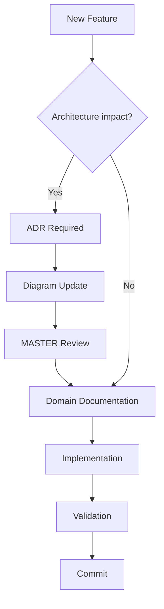
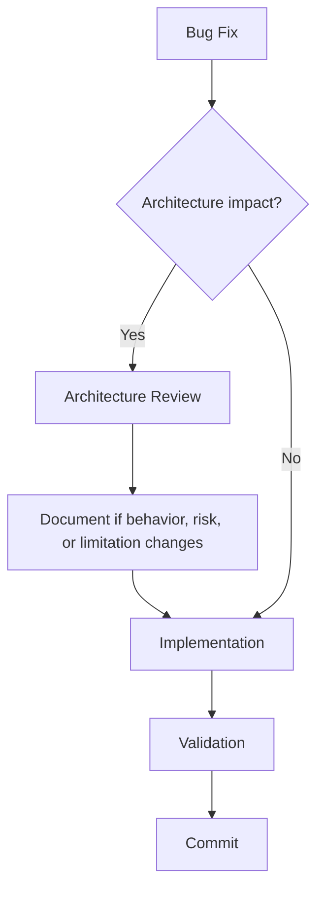
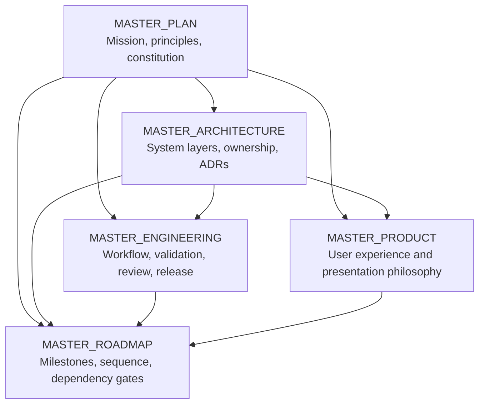

# QuantTerminal Master Engineering

**Status:** Canonical engineering handbook  
**Audience:** Engineers, reviewers, architects, ChatGPT, Codex, automation agents, and future contributors  
**Scope:** Engineering philosophy, lifecycle, validation, documentation, AI collaboration, and release governance  

## 1. Engineering Philosophy

QuantTerminal engineering exists to protect truth, responsiveness, and
maintainability. The project handles market evidence, historical data,
repository records, product workflows, and future reasoning systems. A small
shortcut can become a false market claim. Engineering discipline is therefore
part of product integrity.

### Architecture First

Architecture defines ownership before code is written. This prevents layers
from absorbing work they should not own, keeps dependencies one-way, and makes
future reasoning possible without rewriting the data foundation.

### Documentation First

Documentation is not a postscript. Every meaningful change must have a written
reason, boundary, and validation path. Documentation lets humans and AI agents
understand not only what changed, but why the change was allowed.

### Repository First

Durable facts and versioned records belong behind Repository contracts. Direct
storage shortcuts weaken idempotency, lineage, provider transparency, and
future auditability.

### Evidence First

Engineering must preserve the distinction between observed evidence and
interpretation. Missing data is a valid state. It must not be hidden behind
synthetic values, inferred confidence, or vague fallbacks.

### Validation Before Merge

No implementation is complete until its validation is known. Validation should
prove the task requirement, protect against regressions, and document any
remaining risk.

### Small Incremental Changes

Small changes are easier to review, validate, revert, and reason about. Broad
rewrites require architectural justification because they increase hidden
regression risk.

### Explainability Before Cleverness

Code and architecture should make intent clear. Clever abstractions are only
valuable when they reduce real complexity without hiding ownership or side
effects.

### Simplicity Before Optimization

Optimization follows a known bottleneck and a documented constraint.
Premature optimization can obscure data correctness and make validation
harder. Responsiveness matters, but it must be achieved without fabricating
completeness.

### Long-Term Maintainability

Every change should leave the next contributor with a clearer system. Durable
identity, explicit boundaries, structured errors, and readable documentation
are long-term assets.

### Visual Documentation

Architecture is easier to preserve when it can be seen. Canonical Mermaid
diagrams are engineering artifacts, not decoration. They help reviewers catch
boundary drift before it becomes code.

## 2. Engineering Lifecycle

The engineering lifecycle is:

```text
Idea
  -> Architecture Review
  -> Documentation
  -> Diagram Update
  -> Sprint Planning
  -> Implementation
  -> Validation
  -> Git Review
  -> Release
  -> Retrospective
```

### Idea

An idea describes a desired product, data, architecture, or operational
outcome. It is not ready for implementation until scope, owner, constraints,
and expected evidence are clear.

### Architecture Review

Architecture review determines where the work belongs, which layer owns it,
which boundaries it touches, and whether an ADR or diagram change is required.

### Documentation

Documentation records intent, constraints, accepted inputs, forbidden work,
and validation expectations. For architecture or process work, documentation
may be the deliverable.

### Diagram Update

When a change alters architecture, ownership, dependency flow, runtime flow,
or expansion boundaries, the canonical Mermaid diagram pack must be reviewed
and updated if needed.

### Sprint Planning

Sprint planning converts the goal into bounded work: read-first documents,
allowed files, forbidden changes, validation commands, expected output, and
exit criteria.

### Implementation

Implementation makes the smallest scoped change that satisfies the sprint.
It must preserve existing behavior unless the sprint explicitly authorizes a
behavior change.

### Validation

Validation proves the change against acceptance criteria, regression risks,
architecture impact, documentation impact, and performance or idempotency
requirements where relevant.

### Git Review

Git review checks changed files, scope, accidental edits, untracked artifacts,
commit granularity, and whether generated outputs belong in the repository.

### Release

Release occurs only after review, validation, documentation, and known
limitations are complete. A release must be traceable to the evidence that
made it acceptable.

### Retrospective

Retrospective records what changed, what remains risky, and what the next
engineering step should learn from the sprint.

## 3. Sprint Lifecycle

Every sprint follows a bounded lifecycle.

### Planning

Planning defines the goal, scope, protected areas, required reading, expected
output, validation, and explicit non-goals.

### Architecture Check

The architecture check verifies owner, layer, dependency direction, dataflow,
immutability, repository boundaries, and whether an ADR or diagram update is
needed.

### Documentation Check

The documentation check verifies that the relevant canonical docs, domain
docs, ADRs, investigations, and diagrams are read and that required doc
updates are included in scope.

### Implementation

Implementation is constrained by the sprint. Do not add adjacent capabilities,
new providers, hidden fallbacks, or unrelated refactors.

### Validation

Validation must run the required checks or document why a check is not
applicable. Missing required validation blocks completion unless the sprint
explicitly waives it.

### Diagram Validation

If the sprint changes ownership, dataflow, runtime flow, evidence boundaries,
or expansion boundaries, diagram consistency must be reviewed. Mermaid source
is canonical.

### Commit

Commits should be scoped, reviewable, and tied to the sprint outcome. Commit
only when explicitly requested or when the workflow requires it.

### Release

Release requires validation evidence, documentation, known limitations, and
review status. Release does not mean every future capability is complete.

### Retrospective

Retrospective documents open gaps, follow-up recommendations, and whether
future work should extend, audit, or freeze the current layer.

### Definition Of Ready

A sprint is ready when:

- objective and non-goals are explicit;
- required reading is identified;
- ownership and architecture boundary are known;
- protected systems are identified;
- validation expectations are defined;
- documentation and diagram impacts are known;
- success output is clear.

### Definition Of Done

A sprint is done when:

- scope is satisfied;
- forbidden work is absent;
- validation is complete or explicitly not applicable;
- documentation is updated when required;
- diagrams are updated or confirmed unaffected;
- known limitations are stated;
- changed files are understood;
- no fabricated data, evidence, or implementation claim was introduced.

## 4. Git Strategy

Git exists to make work reviewable, reversible, and attributable.

### Branch Strategy

Feature work should happen on scoped feature branches. Release work should
use release branches when a milestone is being stabilized. Hotfix branches are
reserved for urgent production defects or certification defects.

### Feature Branches

Feature branches should map to one bounded sprint or cohesive change. Avoid
mixing documentation generation, runtime work, UI redesign, and unrelated
cleanup in one branch.

### Release Branches

Release branches collect validated work for a milestone. They should accept
only fixes, documentation corrections, validation updates, and release notes
after stabilization begins.

### Hotfix Branches

Hotfix branches should be minimal and evidence-backed. They require clear
defect identification, validation, and a follow-up record if the fix exposes
a deeper architectural issue.

### Commit Granularity

Commits should be small enough to review but not so fragmented that the
meaning is lost. A commit should represent one coherent engineering idea.

### Commit Message Conventions

Commit messages should state the domain and outcome. They should avoid
claiming certification, production readiness, or fixes that validation did
not prove.

### Semantic Versioning

Versioning should communicate user-facing and contract impact. Breaking
contract changes, new capabilities, and documentation-only changes must be
distinguishable.

### Release Tags

Release tags mark reviewed milestone states. A tag should reference release
notes, known limitations, and validation evidence.

### Cherry-Pick Policy

Cherry-picks are allowed only when the target branch needs a specific
validated change without unrelated work. The cherry-picked change must retain
its validation context.

### Rollback Policy

Rollback favors the smallest safe reversal. Repository facts are not rolled
back by mutation; corrections require explicit reconciliation or new records.

## 5. Architecture Governance

Architecture changes require governance before implementation.

A significant architecture change requires:

- architecture review;
- an ADR or update to an existing ADR;
- Mermaid diagram review and update when visual architecture changes;
- relevant master document review;
- domain documentation update;
- validation and migration plan where applicable.

No architectural shortcut is permitted. A shortcut is any change that bypasses
the owned layer to get a faster product result, hides a dependency, weakens
idempotency, substitutes providers silently, performs heavy request-path work,
or turns missing evidence into output.

Architecture governance protects future work from today's convenience.

## 6. Coding Standards

These are high-level engineering rules, not a language-specific style guide.

### Naming

Names should reveal ownership and intent. Avoid names that imply certainty,
freshness, production support, or intelligence unless the contract proves it.

### Folder Ownership

Folders should reflect domain ownership. New modules should live near their
owning layer rather than in shared spaces that obscure responsibility.

### Dependency Direction

Dependencies must follow the architecture. Facts flow forward. Knowledge does
not write backward. Presentation does not own business logic. Repository does
not depend on UI or reasoning.

### Error Handling

Expected failure should return structured states, not crashes. Use explicit
unavailable, stale, missing, duplicate, conflict, validation, and storage
states where appropriate.

### Configuration

Configuration should be explicit, scoped, and safe to inspect. Secrets must
not be logged, committed, or encoded into generated artifacts.

### Logging

Logs should help diagnose behavior without leaking secrets or creating false
success. Logging should distinguish unavailable data from implementation
failure.

### Observability

Observable systems should report status, source, freshness, count, identity,
and failure reason. Observability should help answer what happened without
requiring a debugger.

### Module Boundaries

Modules should expose contracts that match their owner. A module should not
quietly collect, persist, interpret, and render in one place.

### Dependency Injection Philosophy

External effects should be injected at boundaries. This keeps runtime logic
testable, provider-neutral, and free from hidden side effects.

### No Hidden Side Effects

A function that validates should not write. A query should not backfill. A
render path should not run heavy reconstruction. A scheduler should not
interpret market meaning.

## 7. Validation Standards

Every implementation must define:

- **Acceptance Criteria:** what must be true for the work to count.
- **Validation Checklist:** commands, smoke checks, scans, screenshots, or
  audit checks required by risk.
- **Regression Risk:** what existing behavior could break.
- **Architecture Impact:** whether ownership, dependency direction, or dataflow
  changed.
- **Documentation Impact:** which docs changed or why none changed.
- **Diagram Impact:** whether canonical Mermaid diagrams changed or were
  reviewed as unaffected.
- **Performance Impact:** request-path cost, responsiveness, heavy dataset
  risk, and caching/projection implications.
- **Idempotency:** duplicate-safe behavior for persistence, sync, execution,
  and repository records when applicable.
- **Observability Impact:** status, logs, health, and failure evidence where
  relevant.

Validation must report what ran, what passed, what failed, and what was not
run. It must not fabricate validation.

## 8. Documentation Standards

Documentation is treated as code.

Every epic produces documentation. Every sprint updates documentation when it
changes architecture, behavior, product responsibility, data contracts,
validation, or known limitations.

Canonical documents are intentionally maintained:

- `MASTER_PLAN.md` owns constitution and enduring why.
- `MASTER_ARCHITECTURE.md` owns system architecture and boundaries.
- `MASTER_ENGINEERING.md` owns process, validation, review, and release.
- `MASTER_PRODUCT.md` owns product and UX direction.
- `MASTER_ROADMAP.md` owns sequencing and milestone direction.

Sprint documents preserve evidence. Domain documents preserve current source
of truth. ADRs preserve decisions. Investigations preserve empirical findings.

Mermaid diagrams are canonical architecture assets. SVG and Figma assets may
be generated later, but they derive from Mermaid sources. Architecture
diagrams must remain synchronized with `MASTER_ARCHITECTURE.md`.

Every significant architectural decision requires an ADR or an update to the
embedded master ADR set.

If `MASTER_ENGINEERING.md` conflicts with `AGENTS.md` or active skill rules,
`AGENTS.md` and active skill rules win until the conflict is resolved in a
documentation governance sprint.

## 9. Diagram Governance

Mermaid source is the canonical diagram artifact.

### Diagram IDs

Canonical diagrams use sequential IDs:

```text
DGM-001
DGM-002
DGM-003
...
```

Future diagrams continue the sequence. IDs are never reused for unrelated
diagrams.

### Naming Convention

Diagram files should use:

```text
DGM-###-short-kebab-title.md
```

Each diagram must include purpose, responsibilities, inputs, outputs, related
ADRs, and related master documents.

### Ownership

Every diagram has one owner. Architecture owns system diagrams by default.
Data, Runtime, Product, Evidence, Reasoning, Expansion, or Engineering may
own specialized diagrams.

### Versioning

Diagram changes are versioned through git history and, when necessary, a
new diagram ID for a materially different architecture. Small corrections may
update the existing diagram.

### Update Policy

Update diagrams when a change affects system context, container ownership,
data flow, repository boundary, runtime flow, evidence boundary, reasoning
boundary, product presentation architecture, or expansion model.

### Review Policy

Diagram review verifies alignment with `MASTER_ARCHITECTURE.md`, related
ADRs, and implemented or explicitly future capabilities. Diagrams must not
imply uncertified production behavior.

### Diagram Lifecycle

```text
Draft
  -> Review
  -> Canonical
  -> Deprecated
  -> Archive
```

Deprecated diagrams remain useful historical artifacts until archived. They
are not deleted by default.

## 10. AI Collaboration Model

AI collaboration must preserve separation of duties. AI can accelerate work,
but it cannot replace review, validation, or evidence.

### ChatGPT

ChatGPT is responsible for:

- architecture;
- planning;
- product thinking;
- review;
- critique;
- sprint design;
- documentation strategy.

ChatGPT should reason from canonical docs and avoid inventing implementation
state beyond evidence.

### Codex

Codex is responsible for:

- implementation;
- refactoring;
- testing support;
- documentation generation;
- mechanical refactors.

Codex must read `AGENTS.md`, active rules, relevant ADRs, investigations, and
domain files before changing behavior. Codex must preserve user changes,
avoid forbidden commands, and report validation honestly.

### Future AI Agents

Future agents may include:

- Repository Agent;
- Replay Agent;
- Research Agent;
- Evidence Agent;
- Reasoning Agent;
- UI Agent;
- Review Agent;
- Validation Agent.

Each agent must have one responsibility, explicit inputs, explicit outputs,
and a reviewable handoff.

### Separation Rules

- AI never approves its own work.
- Generation and validation remain separated.
- Evidence and reasoning remain separated.
- Planning and implementation remain separated when automation is active.
- Human approval remains required for merge automation.
- No agent may fabricate data, validation, screenshots, provider support, or
  business meaning.

## 11. Quality Gates

Every merge requires:

- architecture reviewed;
- validation completed;
- documentation updated or confirmed unaffected;
- diagram consistency checked;
- master documents unaffected or updated;
- regression risk reviewed;
- performance impact reviewed;
- repository invariants preserved;
- protected systems respected;
- no fabricated evidence, data, validation, or implementation claim.

The stricter gate applies when a change touches Repository, historical data,
Replay, Research, Evidence, automation, runtime, scheduler, workers,
protected systems, or AI/reasoning.

## 12. Release Process

The release process is:

```text
Sprint Complete
  -> Review
  -> Release Candidate
  -> Regression Validation
  -> Git Tag
  -> Release Notes
  -> Stable
```

### Sprint Complete

The sprint satisfies its definition of done and has changed-file, validation,
and limitation summaries.

### Review

Review checks scope, architecture, validation, documentation, diagrams,
protected systems, regressions, and no-fabrication rules.

### Release Candidate

A release candidate freezes intended scope. Only fixes, documentation
corrections, validation updates, and release-risk reductions should enter.

### Regression Validation

Regression validation proves that critical workflows, repository invariants,
and product responsiveness remain intact.

### Git Tag

A tag marks the reviewed milestone state. It should correspond to release
notes and known limitations.

### Release Notes

Release notes describe completed work, limitations, validation, and migration
or operator notes without overstating readiness.

### Stable

Stable means the milestone is accepted under its documented constraints. It
does not imply future layers are implemented.

## 13. Engineering Metrics

Engineering health should be measured by evidence of maintainability and
trust, not by volume of output.

Useful metrics include:

- documentation coverage;
- architecture coverage;
- diagram coverage;
- validation coverage;
- repository integrity;
- duplicate rejection;
- build or type-check health;
- regression rate;
- technical debt;
- sprint completion;
- protected-system incident rate;
- unavailable-state correctness;
- performance and responsiveness preservation.

Metrics must not become incentives to fabricate certainty or hide limitations.

## 14. Non-Goals

QuantTerminal engineering explicitly rejects:

- undocumented shortcuts;
- architecture bypasses;
- direct Repository mutations outside approved contracts;
- undocumented dependencies;
- hidden AI-generated logic;
- feature-first architecture;
- implementation without documentation;
- validation claims without evidence;
- request-path heavy historical reconstruction;
- provider substitution without capability mapping;
- synthetic data in production paths;
- hidden side effects;
- merge automation without human approval.

When a desired outcome conflicts with these non-goals, the correct action is
to document the gap, design the architecture, and proceed through review.

## 15. Engineering Decision Tree

Engineering decisions should follow the smallest safe path that preserves
architecture, evidence, and validation.

### New Feature Flow



A new feature requires architecture review when it changes ownership, data
flow, repository records, provider boundaries, runtime behavior, evidence
semantics, request-path cost, page responsibility, automation, or future
reasoning inputs.

### Bug Fix Flow



A bug fix does not need an ADR when it restores intended behavior without
changing ownership, contracts, dependencies, diagrams, or master principles.
It still requires validation and documentation when user-visible behavior,
known limitations, or operational risk changes.

### Mandatory Architecture Review

Architecture review is mandatory when a change:

- creates or changes a durable record kind;
- modifies Repository, Coverage, Projection, Evidence, Runtime, Scheduler, or
  Worker boundaries;
- introduces or changes a provider, source envelope, capability mapping, or
  dataset registry contract;
- changes request-path data access cost or bounded-read behavior;
- changes Facts-vs-Knowledge separation;
- changes AI, reasoning, or interpretation boundaries;
- changes a canonical diagram, ADR, or master document;
- touches protected systems listed in this handbook.

## 16. Change Impact Matrix

This matrix defines which governance artifacts are required when an area
changes. The stricter row applies when a change touches multiple areas.

| Changed area | Required reviews | Required documentation | Required validation | Diagram impact |
| --- | --- | --- | --- | --- |
| Architecture | Architecture and engineering review | ADR, domain doc, relevant MASTER review | Dependency, boundary, no-fabrication, regression checks | Required if ownership, flow, or container changes |
| Engineering | Engineering and review-owner review | `MASTER_ENGINEERING` or engineering domain doc | Workflow, validation-rule, release/process consistency | Required if lifecycle or agent flow changes |
| Repository | Architecture, data, engineering review | Repository/domain doc, dataset contract if affected | Idempotency, duplicate, lineage, persistence, no-direct-write checks | Required if repository boundary changes |
| Evidence | Architecture, research/evidence review | Evidence domain doc and reasoning gate if affected | Readiness, missing/experimental/canonical handling, no-reasoning checks | Required if evidence flow changes |
| Reasoning | Architecture, research, product review | Reasoning gate, ADR, relevant master review | Evidence-boundary, no-fabrication, versioning checks | Required |
| Presentation | Product/design and engineering review | Product/page doc if behavior changes | Responsiveness, unavailable-state, visual/regression checks | Required if presentation architecture changes |
| Runtime | Architecture and engineering review | Runtime domain doc, ADR if contract changes | Identity, lifecycle, serialization, merge, no-side-effect checks | Required if runtime flow changes |
| Product | Product/design review; architecture if dataflow changes | Product/page doc, MASTER_PRODUCT when generated | UX, state language, responsiveness, page responsibility checks | Required if product architecture changes |
| Roadmap | Product, architecture, engineering review | `MASTER_ROADMAP` when generated, roadmap/domain docs | Dependency gate and milestone consistency checks | Usually not required |
| Diagram | Architecture review | Diagram source and index | Diagram syntax/source consistency and master alignment | Required by definition |
| ADR | Architecture review | ADR or embedded master ADR update | Decision consistency and consequence review | Required if decision changes visual architecture |
| MASTER documents | Owning master reviewer plus affected domains | Updated master and source evidence links | Cross-master consistency, no-overclaim, ownership checks | Required if architecture visualization changes |

## 17. Engineering Risk Classification

Risk determines review depth and validation breadth. Risk should be classified
before implementation and revisited before merge.

| Risk | Examples | Review requirements | Validation expectations | Architecture review | Diagram requirement | ADR requirement |
| --- | --- | --- | --- | --- | --- | --- |
| LOW | Documentation clarification, typo, isolated copy correction, non-behavioral comment | Owner or peer review | Scope and changed-file check | Not required unless ownership changes | Not required | Not required |
| MEDIUM | Localized UI state, bounded helper, small docs-backed behavior fix, non-critical validation improvement | Engineering review; product review for UI | Type/check or focused smoke where applicable; regression note | Required if any boundary is touched | Review as unaffected or update if needed | Usually not required |
| HIGH | Repository mapping, dataset contract, provider metadata, Replay/Research path, runtime contract, protected data flow | Architecture and engineering review; domain owner review | Focused smoke, idempotency, regression, prohibited-behavior, performance impact checks | Required | Required if flow/ownership changes | Required for significant contract decisions |
| CRITICAL | Persistence invariants, historical identity, source governance, Facts/Knowledge boundary, automation merge path, reasoning authorization, protected production behavior | Architecture, engineering, product/release as applicable; independent review | Broad regression, duplicate safety, rollback/reconciliation plan, observability, no-fabrication, performance checks | Required | Required | Required |

Risk classification must not be lowered to avoid review. If uncertain, choose
the higher risk level.

## 18. Protected Systems

Protected systems require stronger review because defects can corrupt facts,
break replayability, degrade responsiveness, or create false market meaning.

Protected architectural assets include:

- **Repository:** durable fact and versioned-record boundary.
- **Coverage:** completeness evaluation and dataset-specific expected counts.
- **Projection:** request-safe availability and freshness layer.
- **Evidence:** readiness packets and no-reasoning boundary.
- **Historical Identity:** deterministic identities for facts, backfills,
  observations, outcomes, and projections.
- **Dataset Registry:** resolution, coverage mode, cadence, provider tier, and
  dataset ownership contracts.
- **Replay Contracts:** bounded reads, manual heavy data, unavailable states,
  and no request-time reconstruction.
- **Persistence:** storage adapters, idempotency, duplicate rejection,
  archive semantics, and opaque payload handling.

Protected systems require architecture review when changed, even for small
patches, unless the change is purely textual documentation with no contract
meaning.

Prohibited shortcuts:

- direct storage writes outside Repository contracts;
- rewriting immutable facts instead of reconciliation;
- changing identity bases without migration and ADR;
- treating projection as source truth;
- running exact heavy scans from request paths;
- converting coverage or availability into market interpretation;
- provider substitution without explicit capability mapping;
- adding fallback data that hides unavailable states;
- modifying Replay heavy-data behavior to improve apparent completeness at
  the expense of responsiveness;
- embedding AI reasoning inside evidence or repository layers.

## 19. Engineering Checklist

Use this checklist before commit, review, or handoff. It is intentionally
usable by humans, Codex, and future automation agents.

```text
Before Commit / Handoff

[ ] Scope confirmed
[ ] Required reading completed
[ ] Architecture impact reviewed
[ ] Protected systems reviewed
[ ] Risk level assigned
[ ] Validation completed or explicitly not applicable
[ ] Documentation updated or confirmed unaffected
[ ] Diagram reviewed or updated
[ ] ADR reviewed or updated when required
[ ] MASTER documents checked
[ ] Git status reviewed
[ ] Untracked files reviewed
[ ] User or unrelated changes preserved
[ ] Repository invariants preserved
[ ] No direct storage mutation introduced
[ ] No fabricated evidence or validation introduced
[ ] No hidden runtime changes introduced
[ ] No request-path heavy historical work introduced
[ ] Unavailable/stale/partial states preserved
[ ] Known limitations documented
```

The checklist does not replace judgment. It makes judgment auditable.

## 20. Engineering Pyramid

Every engineering decision flows downward from durable intent to concrete
release evidence.

```text
Vision
  -> Architecture
  -> Engineering
  -> Implementation
  -> Validation
  -> Release
```

- **Vision** comes from `MASTER_PLAN.md`: why QuantTerminal exists and what it
  must never compromise.
- **Architecture** comes from `MASTER_ARCHITECTURE.md`: ownership, dataflow,
  layer boundaries, and ADRs.
- **Engineering** comes from this handbook: how work is planned, implemented,
  validated, reviewed, documented, and released.
- **Implementation** is the smallest scoped change that satisfies the sprint.
- **Validation** proves the implementation and records remaining risk.
- **Release** accepts the result under documented constraints.

When a lower layer conflicts with an upper layer, stop and resolve the
conflict before continuing. Implementation convenience does not override
architecture. Architecture does not override the project constitution.

## 21. MASTER Dependency Graph

The master documents have separate ownership and a deliberate dependency
direction.



Ownership:

- `MASTER_PLAN.md` owns why.
- `MASTER_ARCHITECTURE.md` owns system boundaries.
- `MASTER_ENGINEERING.md` owns how work is done.
- `MASTER_PRODUCT.md` owns user-facing experience.
- `MASTER_ROADMAP.md` owns sequencing and milestones.

Dependency direction:

- Plan constrains every other master.
- Architecture constrains engineering, product implementation, and roadmap
  feasibility.
- Engineering constrains how architecture and roadmap work is executed.
- Product constrains presentation and user experience.
- Roadmap sequences work but does not redefine principles or architecture.
