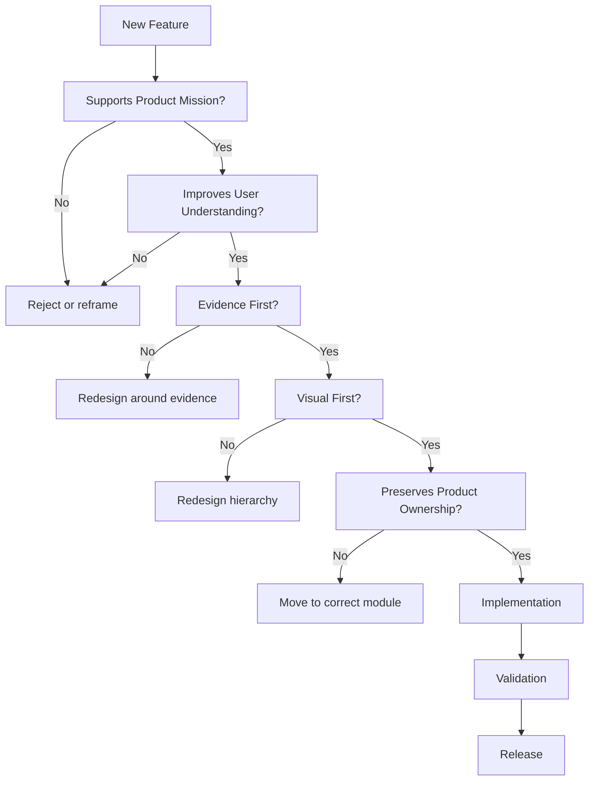
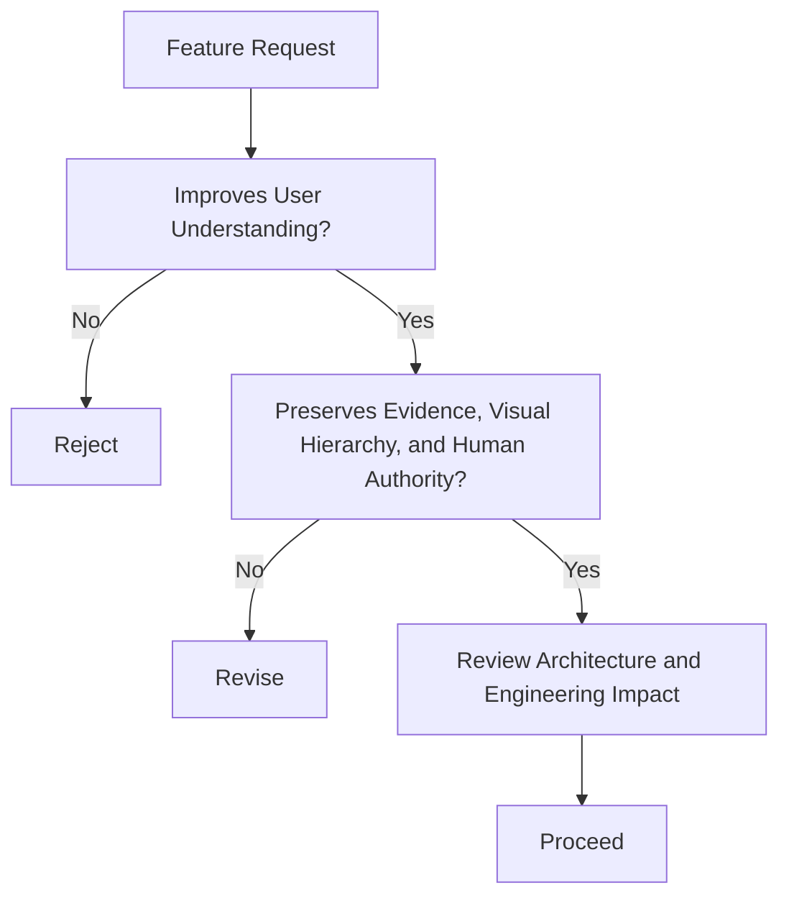
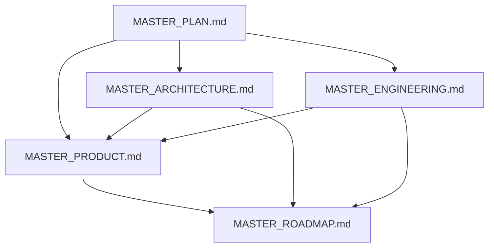

# QuantTerminal Master Product

**Status:** Canonical product constitution  
**Audience:** Product leaders, designers, engineers, reviewers, AI systems, and contributors  
**Scope:** Product philosophy, user experience, information hierarchy, visualization, and future UX direction  

## 1. Product Mission

QuantTerminal exists to help users understand digital-asset markets through
real evidence, clear hierarchy, and human-centered decision support.

From the user's perspective, the problem is not lack of data. The problem is
that market data arrives fragmented, fast, noisy, and difficult to trust.
Charts, feeds, dashboards, social commentary, and indicators often force users
to reverse-engineer meaning from disconnected fragments.

QuantTerminal solves this by organizing evidence into a coherent intelligence
workflow:

```text
What is happening?
Why does it matter?
What evidence supports it?
What contradicts it?
What should I inspect next?
```

Existing market tools are insufficient because they tend to be chart-first,
feed-first, signal-first, or action-first. QuantTerminal is evidence-first. It
does not compete by showing more widgets. It competes by making real evidence
understandable.

## 2. Product Vision

QuantTerminal will become an evidence-driven market intelligence terminal for
digital assets and, later, adjacent markets.

The long-term vision is a workspace where users can move from a market state
to supporting evidence, from evidence to replay, from replay to research, and
from research to decision support without losing provenance or context.

The product should advance toward:

- evidence-driven market intelligence;
- decision support without decision replacement;
- explainability before AI conclusions;
- human-centered AI;
- visual understanding before text-heavy explanation;
- cross-market intelligence;
- repository-backed trust;
- personalized workspaces that preserve context.

QuantTerminal should help users think better. It should not pretend to think
for them.

## 3. Product Principles

### Visual First

Users should see the market state before reading paragraphs. Visual hierarchy,
charts, timelines, badges, and evidence cards should carry the first layer of
understanding.

### Evidence First

Every insight must be traceable to observed evidence, source health, coverage,
or explicit unavailability. Evidence must appear close to the claim it
supports.

### Explain, Don't Predict

QuantTerminal explains observed market conditions and evidence relationships.
It must not silently convert evidence into prediction, advice, or certainty.

### 5-Second Rule

A user should understand the primary state of a screen within five seconds.
If the user must scan many panels to discover the main point, the hierarchy is
wrong.

### Progressive Disclosure

Users choose depth. The product starts with headline and evidence, then opens
charts, replay, research, and raw repository detail only as needed.

### Consistency

Terminology, states, navigation, evidence cards, and visual language should be
consistent across pages. A state such as `UNAVAILABLE` should mean the same
thing everywhere.

### Trust Over Attention

The product should earn trust through honesty, not urgency. It should not use
sensational language, hidden scoring, or synthetic confidence to keep
attention.

### Human Decision Authority

QuantTerminal prepares understanding. The user makes the decision. AI,
reasoning, alerts, and future automation must not erase human authority.

### Composable Intelligence

Evidence, replay, research, alerts, and future reasoning should compose into
workflows. Each module should retain its ownership while handing context to
the next module.

### Timeless Information Architecture

The product should be organized around enduring user questions rather than
temporary datasets or implementation details.

## 4. Information Hierarchy

Every screen should follow this hierarchy:

```text
Headline
  -> Market Direction
  -> Evidence
  -> Reasoning
  -> Historical Analog
  -> Supporting Data
  -> Raw Repository
```

### Headline

The headline gives the user the first answer. It should be short, specific,
and grounded in the page's purpose.

### Market Direction

Market direction states the current read when supported. It must not imply
certainty when evidence is partial, stale, unavailable, or experimental.

### Evidence

Evidence shows what was observed and whether it is current, partial,
experimental, stale, missing, or unavailable.

### Reasoning

Reasoning connects evidence to interpretation only when the reasoning boundary
is approved. Until then, reasoning should remain clearly distinguished from
facts.

### Historical Analog

Historical analogs help users compare current states with past states. They
must remain source-backed and must not become fabricated precedent.

### Supporting Data

Supporting data includes charts, tables, metrics, and diagnostics. It belongs
below the first-read layer unless the page's primary job is expert inspection.

### Raw Repository

Raw repository data is the deepest layer. It is useful for audit and expert
review, but it should not be the first experience for most users.

## 5. Information Density Ladder

QuantTerminal should offer increasing depth without forcing complexity.

| Level | Product layer | Purpose |
| --- | --- | --- |
| Level 1 | Headline | Immediate state and user orientation. |
| Level 2 | Evidence Cards | Source-backed observations, freshness, warnings, contradictions. |
| Level 3 | Charts | Visual structure, trends, flows, positioning, and timing. |
| Level 4 | Replay | Historical event reconstruction and validation. |
| Level 5 | Research | Deep investigation, thesis context, support, conflict, and source intelligence. |
| Level 6 | Raw Repository | Audit trail, source records, coverage, and low-level evidence. |

Users choose depth. The product should invite deeper inspection without making
the first screen feel incomplete.

## 6. UX Golden Rules

- One primary message per screen.
- Avoid duplicate information unless repetition improves handoff clarity.
- Visual before text.
- Evidence before conclusions.
- Every insight should be explainable.
- Reduce cognitive load before adding detail.
- Consistency over novelty.
- Fast scanning before deep reading.
- Show source, freshness, and availability where trust depends on them.
- Preserve user context during navigation.
- Never hide missing evidence with decoration.
- Never make secondary analytics compete with the main conclusion.

## 7. Product Architecture

QuantTerminal product modules each own one primary user question.

### Dashboard

Dashboard owns fast market decision orientation.

It answers: `What is happening and why should I care?`

Dashboard shows market direction, drivers, evidence, and secondary decision
support. It must remain lightweight and must not become a deep historical or
research workspace.

### Markets

Markets owns live market discovery and verification.

It answers: `Which markets deserve attention and does live structure confirm it?`

Markets emphasizes price, funding, open interest, orderflow, liquidation, and
market structure. It is real-time first.

### Scanner

Scanner owns change detection and opportunity monitoring.

It answers: `What changed and what needs attention now?`

Scanner should surface new, active, aging, and expired candidates clearly. It
should not become Trade execution or Research investigation.

### Trade

Trade owns execution planning and candidate evaluation.

It answers: `How should I evaluate this selected candidate?`

Trade keeps thesis, evidence, risk, invalidation, and execution planning
aligned. It must not become a signal generator.

### Replay

Replay owns historical event explanation and validation.

It answers: `What happened in this window?`

Replay prioritizes chart, liquidation, open interest, funding, and optional
heavy evidence. It must remain responsive and must not run expensive
reconstruction in the request path.

### Research

Research owns deep investigation.

It answers: `Why should I believe this thesis?`

Research organizes thesis context, supporting evidence, conflicting evidence,
narrative timeline, source intelligence, related markets, and handoffs.

### Alerts

Alerts own attention routing.

They answer: `What changed enough that I should look now?`

Alerts must be evidence-backed, explainable, and routed to the right module.

### Future Modules

Future modules may include automation, reasoning, enterprise views,
multi-agent review, or personalized workspaces. They must enter through the
same evidence, ownership, and navigation principles.

## 8. Product Navigation

Navigation should preserve context, reduce disorientation, and support both
fast scanning and deep investigation.

### Entry Points

Users may enter through Dashboard, a symbol, an alert, a replay window, a
research thesis, or a shared link. Each entry must establish context quickly.

### Primary Navigation

Primary navigation should remain stable:

```text
Dashboard
Markets
Scanner
Trade
Research
Replay
Settings / Operations
```

### Cross-Navigation

Cross-navigation should move users from one ownership domain to the next:

- Dashboard to Markets for live verification.
- Dashboard or Scanner to Trade for candidate planning.
- Dashboard, Trade, or Research to Replay for historical validation.
- Replay to Research for implications.
- Research to Trade when a thesis becomes actionable.

### Deep-Linking

Deep links should preserve symbol, timeframe, date, hour, evidence identity,
or selected thesis when available. A deep link should not require the user to
rebuild context manually.

### Context Preservation

Navigation should carry the active symbol, market, timeframe, evidence, case,
or thesis when that context is source-backed and relevant.

### Return Paths

Every deep workflow should provide an obvious way back to the source context.
Replay, Research, and Trade should not feel like dead ends.

### Search Philosophy

Search should help users find symbols, evidence, historical cases, research
contexts, and future artifacts. Search must distinguish source-backed records
from generated or unavailable material.

## 9. Evidence Card Philosophy

Evidence Cards are the primary product unit for trust.

### Purpose

An Evidence Card turns one source-backed observation or evidence group into a
scannable product object.

Every Evidence Card should answer:

```text
What happened?
Why does it matter?
How confident is the evidence quality?
What contradicts it?
```

### Structure

An Evidence Card should include:

- title;
- observed fact;
- source;
- freshness;
- availability;
- confidence or quality context when source-backed;
- warning or limitation;
- contradiction when available;
- related chart, replay, or research link.

### Confidence

Confidence in an Evidence Card describes evidence quality or provider
confidence only when source-backed. It must not become thesis confidence
unless a future reasoning contract supports it.

### Warnings

Warnings include stale, partial, missing, experimental, non-canonical,
unverified, low coverage, or conflicting evidence.

### Historical Context

Cards may link to historical context or replay when available, but they must
not imply a historical analog exists when it does not.

### Related Research

Cards may link to Research when a thesis, narrative, source, or conflict needs
deeper investigation.

### Supporting Charts

Charts should support the card's observation. They should not introduce a
second unspoken claim.

### Source Transparency

Source identity, timestamp, provider tier, and availability state should be
visible where trust depends on them.

## 10. Visualization Philosophy

QuantTerminal should favor visual understanding over textual explanation.

Prioritized visualization forms:

- charts for price, flow, positioning, and time series;
- heatmaps for intensity, clustering, and comparative state;
- timelines for cause, sequence, and replay;
- network graphs for relationships and propagation;
- flow diagrams for capital, evidence, and process;
- infographics for layered explanations;
- visual narratives for guided investigation.

Tables are useful when precision, comparison, or audit detail matters. They
should not be the default first-read format when a visual form can reveal the
state more clearly.

Text supports visuals. It should clarify, label, warn, and explain provenance.
It should not carry the full cognitive load of the product.

## 11. User Personas

### Beginner

Goal: understand what matters without drowning in raw data.

Navigation: Dashboard first, then Evidence Cards, then guided Replay or
Research.

Information depth: Levels 1-3 most of the time.

Preferred workflow: headline, explanation, visual evidence, simple next step.

### Intermediate

Goal: validate market state and build confidence in a thesis.

Navigation: Dashboard, Markets, Scanner, Replay, and Trade.

Information depth: Levels 2-4.

Preferred workflow: evidence cards, charts, live verification, replay window,
candidate planning.

### Professional

Goal: move quickly from state to validation to action planning.

Navigation: Markets, Scanner, Dashboard, Replay, Trade, Research.

Information depth: Levels 2-6 as needed.

Preferred workflow: fast scan, dense evidence, bounded historical validation,
source health, execution planning.

### Researcher

Goal: understand why a market state matters and what evidence supports or
contradicts it.

Navigation: Research, Replay, Evidence, Repository detail.

Information depth: Levels 4-6.

Preferred workflow: thesis, support, conflict, narrative timeline, historical
cases, source provenance.

### Enterprise

Goal: trust, auditability, repeatability, integration, and oversight.

Navigation: dashboards, evidence exports, repository-backed summaries,
enterprise APIs, review views.

Information depth: Levels 2-6 depending on role.

Preferred workflow: standardized evidence, audit trail, controlled exports,
team decision support.

## 12. User Journey

### Daily Workflow

```text
Market open
  -> Dashboard
  -> Evidence
  -> Replay
  -> Research
  -> Decision
  -> Export
  -> Automation
```

The daily workflow begins with orientation, then expands only when the user
needs more certainty, context, or action planning.

### Beginner Journey

```text
Dashboard headline
  -> Top evidence cards
  -> Simple chart
  -> Explanation of missing or conflicting evidence
  -> Guided Replay or Research link
  -> Decision to watch, ignore, or learn more
```

The beginner journey should reduce intimidation. It should not hide
uncertainty, but it should explain it clearly.

### Professional Journey

```text
Dashboard or Scanner scan
  -> Markets verification
  -> Evidence quality check
  -> Replay validation
  -> Research support and conflict review
  -> Trade planning
  -> Export or future automation handoff
```

The professional journey should be dense, fast, and context-preserving. It
should allow depth without blocking the first read.

## 13. Product Consistency Rules

Every screen should:

- look related to the rest of QuantTerminal;
- use consistent terminology;
- share interaction patterns;
- reuse components;
- reuse Evidence Cards;
- reuse visualization language;
- expose source and freshness consistently;
- preserve unavailable, stale, missing, partial, and loading semantics;
- keep page ownership distinct;
- support handoffs without merging page responsibilities.

Consistency does not mean every page has the same density. It means every page
feels like part of the same intelligence system.

## 14. Accessibility

Accessibility is a product requirement, not a polish pass.

### Readable Typography

Typography should support fast scanning and dense information. Text must be
legible across desktop, tablet, and mobile contexts.

### Keyboard Support

Core workflows should remain navigable by keyboard where practical, especially
search, filters, tabs, evidence lists, and modal or detail views.

### Color Accessibility

Color must not be the only carrier of meaning. State should use text, labels,
shape, or icons in addition to color.

### Responsive Layouts

Responsive layouts should preserve hierarchy. Mobile should not simply shrink
dense desktop panels until they become unreadable.

### Mobile-First Considerations

Mobile should support orientation, alerts, evidence review, and light
investigation. Heavy workflows may remain better on desktop but should degrade
gracefully.

### Desktop Productivity

Desktop should support density, comparison, multi-panel scanning, keyboard
use, and deep workflows without sacrificing hierarchy.

## 15. Future Product Vision

Future experiences should extend the same product philosophy.

### Hyperliquid

Hyperliquid should enter as a source-governed market vertical with evidence,
coverage, replay, and research pathways.

### Macro

Macro should explain context, not invent regime labels. Macro evidence must be
source-backed and clearly timestamped.

### RWA

RWA experiences should connect real-world asset evidence to market context
without overstating liquidity, freshness, or comparability.

### Equities

Equities should adopt the same evidence hierarchy while respecting different
market structure, sessions, and source semantics.

### Enterprise

Enterprise experiences should emphasize auditability, repeatability,
permissions, exports, and shared decision context.

### Mobile

Mobile should focus on orientation, alerts, evidence checks, and continuation
of desktop workflows.

### API

APIs should expose source-transparent, bounded, evidence-aware contracts.

### SDK

SDKs should help external users compose evidence without bypassing
provenance, availability, or no-fabrication rules.

### Multi-Agent

Multi-agent experiences should separate planning, evidence, reasoning,
validation, and review. Agents should assist users without hiding the source
trail.

### Voice

Voice should summarize and navigate evidence, not invent market conclusions.

### Personalized Workspace

Personalization should adapt layout, saved context, alerts, and preferred
depth while preserving canonical evidence and terminology.

## 16. Product Metrics

Product metrics should measure user understanding, trust, and workflow quality.

Useful metrics include:

- time to first insight;
- time to first decision;
- navigation depth;
- evidence usage;
- Replay engagement;
- Research completion;
- information overload;
- user retention;
- trust metrics;
- unavailable-state comprehension;
- handoff completion;
- evidence drilldown rate;
- return-to-context success.

Do not optimize for attention at the expense of truth. A metric that rewards
hype, hidden uncertainty, or unsupported confidence is a bad metric.

## 17. Non-Goals

QuantTerminal is not:

- a signal-selling platform;
- a prediction generator;
- a news feed;
- a social media clone;
- a charting terminal only;
- a hype platform;
- a broker execution engine;
- a replacement for human judgment.

AI does not replace user judgment. Evidence does not become advice. Missing
data does not become neutrality. Product polish does not justify fabricated
certainty.

QuantTerminal exists to make real evidence usable.

## 18. Product Decision Tree

Product decisions must be evaluated by mission fit, user understanding,
evidence integrity, visual clarity, and ownership boundaries before they move
to implementation.





Architectural review is mandatory when a product change alters page
ownership, evidence semantics, navigation, repository dependency, reasoning
boundary, or user decision authority. Engineering review is mandatory when a
product change affects runtime behavior, data access, responsiveness,
validation, protected systems, or persistence.

## 19. Product Change Impact Matrix

| Product area | Related MASTER docs | Diagram impact | UX review | Engineering review | Architecture review |
| --- | --- | --- | --- | --- | --- |
| Dashboard | `MASTER_PLAN.md`, `MASTER_PRODUCT.md`, `MASTER_ARCHITECTURE.md` | Product or presentation diagram if hierarchy changes. | Required for first-read clarity and evidence placement. | Required if data loading, responsiveness, or page behavior changes. | Required if Dashboard ownership expands. |
| Replay | `MASTER_PRODUCT.md`, `MASTER_ARCHITECTURE.md`, `MASTER_ENGINEERING.md` | Runtime, repository, or product diagram if flow changes. | Required for replay priority, degraded states, and bounded loading. | Required for protected historical systems. | Required for repository, projection, or heavy-data boundaries. |
| Research | `MASTER_PRODUCT.md`, `MASTER_ARCHITECTURE.md` | Evidence or product diagram if research flow changes. | Required for depth, thesis support, and conflict presentation. | Required if repository or source access changes. | Required if reasoning or evidence ownership changes. |
| Markets | `MASTER_PRODUCT.md`, `MASTER_ARCHITECTURE.md` | Product diagram if live market flow changes. | Required for real-time scanability. | Required if live data access changes. | Required if Markets becomes historical-heavy. |
| Trade | `MASTER_PRODUCT.md`, `MASTER_ENGINEERING.md` | Product diagram if execution-planning flow changes. | Required for candidate clarity and human authority. | Required if state stability or candidate flow changes. | Required if Trade approaches broker execution or signal generation. |
| Evidence Cards | `MASTER_PRODUCT.md`, `MASTER_ARCHITECTURE.md` | Evidence diagram if card semantics change. | Required for trust, warnings, contradictions, and source transparency. | Required if card data contracts change. | Required if evidence and reasoning boundaries change. |
| Navigation | `MASTER_PRODUCT.md`, `MASTER_ENGINEERING.md` | Product diagram if primary flow changes. | Required for context preservation and return paths. | Required if routing or state handling changes. | Required if module ownership changes. |
| Visualization | `MASTER_PRODUCT.md`, `MASTER_ARCHITECTURE.md` | Product or presentation diagram if visual language changes. | Required for hierarchy, density, and accessibility. | Required if rendering performance changes. | Required if visualization implies new reasoning or evidence semantics. |
| Information Hierarchy | `MASTER_PLAN.md`, `MASTER_PRODUCT.md` | Product diagram if hierarchy changes. | Required. | Required when implementation contracts are affected. | Required for any change to evidence, reasoning, or repository order. |
| User Journey | `MASTER_PRODUCT.md`, `MASTER_ROADMAP.md` | Product diagram if journey changes. | Required. | Required if workflow state changes. | Required if journey crosses new subsystem boundaries. |
| Accessibility | `MASTER_PRODUCT.md`, `MASTER_ENGINEERING.md` | Usually none unless layout model changes. | Required. | Required if component behavior changes. | Required only for structural product changes. |
| Metrics | `MASTER_PRODUCT.md`, `MASTER_ENGINEERING.md`, `MASTER_ROADMAP.md` | Usually none. | Required to avoid attention-optimizing metrics. | Required if telemetry contracts change. | Required if metrics redefine product goals. |

## 20. Product Quality Classification

| Level | UX quality | Information quality | Visual quality | Evidence quality | Consistency |
| --- | --- | --- | --- | --- | --- |
| LEVEL A - Exceptional | The user understands the primary state immediately and can deepen without friction. | Claims, evidence, warnings, and contradictions are clear. | Visuals carry meaning before text and remain accessible. | Evidence is source-transparent, current when possible, and honest when unavailable. | Matches product language and patterns across the system. |
| LEVEL B - Production Ready | The workflow is clear and stable for intended users. | Information is correct, organized, and not misleading. | Visual hierarchy works across primary viewports. | Evidence states are visible and no unsupported certainty is introduced. | Uses established components and terminology. |
| LEVEL C - Usable | The user can complete the workflow, but hierarchy or clarity needs refinement. | Information is mostly clear but may require extra interpretation. | Visuals are functional but not yet strong enough for fast scanning. | Evidence is present, though warnings or provenance may need improvement. | Some inconsistencies exist but do not break trust. |
| LEVEL D - Needs Redesign | The workflow causes confusion, hides the main point, or overloads the user. | Claims are ambiguous, duplicated, or poorly ordered. | Visuals decorate more than explain or fail accessibility expectations. | Evidence is missing, unclear, stale without warning, or over-interpreted. | The experience feels detached from QuantTerminal. |

LEVEL A is the aspiration for canonical workflows. LEVEL B is the release
standard for production user paths. LEVEL C may be acceptable only for bounded
internal or transitional experiences. LEVEL D must not be treated as complete.

## 21. Product Invariants

These rules are never intentionally violated:

- Evidence always precedes reasoning.
- Reasoning always references evidence.
- Users always retain decision authority.
- Visualization always precedes long-form text when a visual form can carry
  the state more clearly.
- Repository remains the ultimate source of truth.
- Progressive disclosure is preserved.
- Consistency is preferred over novelty.
- Missing, stale, partial, experimental, or unavailable evidence remains
  explicit.
- Product pages do not fabricate confidence, evidence, freshness, neutrality,
  or certainty.
- Page ownership remains distinct.
- Trust is preferred over attention.
- AI assists understanding but does not replace judgment.

## 22. Product Review Checklist

Before release, every product change should answer:

- [ ] Supports Product Mission.
- [ ] Supports Product Vision.
- [ ] Improves user understanding.
- [ ] Evidence First is maintained.
- [ ] Visual First is maintained.
- [ ] Progressive Disclosure is maintained.
- [ ] Information Hierarchy is preserved.
- [ ] Product ownership is preserved.
- [ ] Accessibility is reviewed.
- [ ] Mobile behavior is reviewed.
- [ ] Diagram impact is reviewed.
- [ ] MASTER documents are reviewed.
- [ ] Engineering impact is reviewed.
- [ ] Architecture impact is reviewed.
- [ ] No fabricated evidence, confidence, freshness, or neutrality is added.
- [ ] Unavailable, stale, partial, and experimental states remain explicit.
- [ ] Human decision authority remains intact.

## 23. Product Pyramid

Every product experience builds upward from facts toward user decision.

```text
User Decision
  ^
Reasoning
  ^
Evidence
  ^
Visualization
  ^
Repository
```

Repository facts make the experience auditable. Visualization makes those
facts understandable. Evidence gives the visual state provenance and quality.
Reasoning, when allowed, connects evidence without inventing facts. The user
retains the final decision.

The pyramid also defines the failure mode. If repository facts are missing,
the product may show unavailability. It must not skip upward and invent
evidence, reasoning, or decisions.

## 24. Product Dependency Graph



`MASTER_PLAN.md` defines why QuantTerminal exists. `MASTER_ARCHITECTURE.md`
defines the system boundaries and data responsibilities that product
experiences must respect. `MASTER_ENGINEERING.md` defines the process for
changing the product safely. `MASTER_PRODUCT.md` defines the user experience
and product decision rules. `MASTER_ROADMAP.md` sequences future work but does
not redefine product principles.

## 25. Product Principles Validation

The current product principles are internally consistent and should remain
canonical.

| Principle | Status | Relationship | Validation |
| --- | --- | --- | --- |
| Visual First | Canonical | Defines the first-read format. | Complements Evidence First by making evidence understandable. |
| Evidence First | Canonical | Defines the trust boundary. | Prevents unsupported claims and anchors all insight. |
| Explain, Don't Predict | Canonical | Defines interpretation limits. | Keeps the product out of signal-selling and false certainty. |
| 5-Second Rule | Canonical | Defines scanability. | Complements Progressive Disclosure by making the first layer clear. |
| Progressive Disclosure | Canonical | Defines depth control. | Allows expert depth without forcing beginner complexity. |
| Consistency | Canonical | Defines product coherence. | Prevents isolated page behavior and terminology drift. |
| Trust Over Attention | Canonical | Defines ethical product posture. | Prevents hype, urgency traps, and synthetic confidence. |
| Human Decision Authority | Canonical | Defines agency. | Keeps AI, alerts, and future automation subordinate to the user. |
| Composable Intelligence | Canonical | Defines workflow design. | Allows modules to hand off context without merging ownership. |
| Timeless Information Architecture | Canonical | Defines durability. | Keeps navigation and hierarchy anchored in enduring questions. |

No blocking duplication is present. Visual First and Evidence First address
different questions: how users first understand a state, and why they should
trust it. The 5-Second Rule and Progressive Disclosure also serve different
purposes: fast orientation and optional depth.

Two ideas require constant review even though they do not need separate
top-level principles: Source Transparency and Graceful Unavailability. Both
are already expressed through Evidence First, Trust Over Attention,
Consistency, and the Product Invariants.

## 26. Future UX Expansion

Future UX expansion should make QuantTerminal more personal, collaborative,
and spatial without weakening its evidence-first foundation.

Planned directions include:

- workspace customization;
- saved layouts;
- AI-assisted navigation;
- personal dashboards;
- context-aware recommendations;
- enterprise workflows;
- collaborative research;
- multi-monitor optimization;
- mobile companion experience;
- exportable evidence packets;
- team review and approval flows;
- personalized depth settings.

These experiences must preserve source transparency, progressive disclosure,
human decision authority, and no-fabrication rules. Personalization may change
layout, defaults, navigation shortcuts, and preferred depth. It must not
change the underlying facts, hide uncertainty, or replace evidence with
unsupported confidence.
