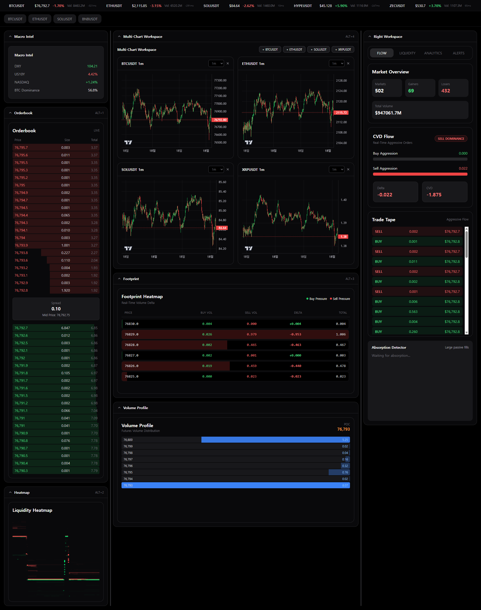
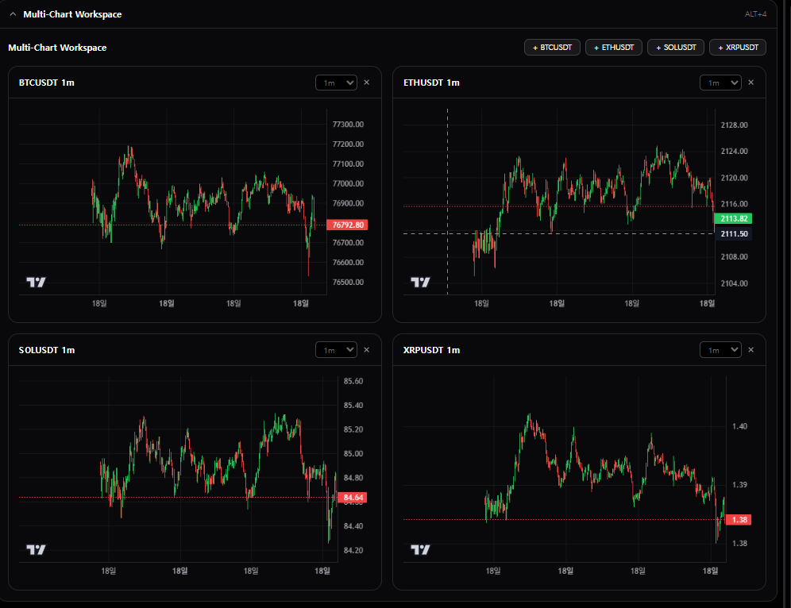
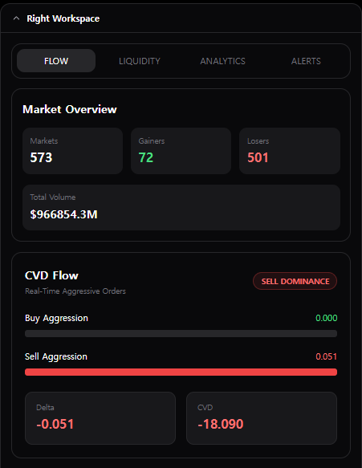
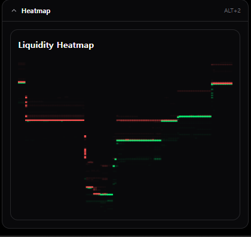
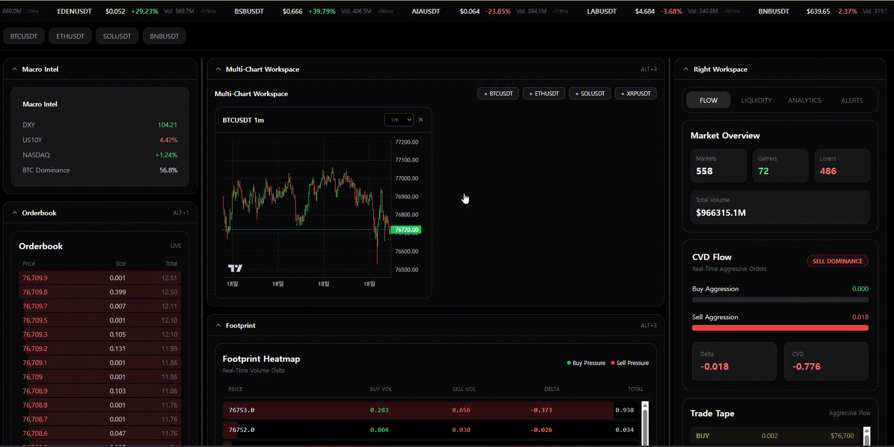

# QuantTerminal

## Geopolitical + Market Intelligence Terminal for Crypto Traders and Exchange Strategy Teams

Realtime crypto intelligence platform focused on:

- High performance market monitoring
- Multi-chart trading workflows
- Exchange-grade websocket infrastructure
- Orderflow visualization
- Geopolitical intelligence integration
- AI-ready terminal architecture

---

# Live Demo

🌐 https://quantterminalai.vercel.app/

---

# Vision

QuantTerminal is designed as a next-generation crypto intelligence terminal combining:

- Realtime market infrastructure
- Exchange-grade data systems
- Trader-focused UX
- Geopolitical event monitoring
- AI-assisted market intelligence

The long-term goal is to build a Bloomberg-style intelligence terminal for digital assets.

---

# Core Features

## Realtime Binance Futures Integration

- Binance Futures WebSocket streams
- Low latency ticker updates
- Realtime orderbook streaming
- Live kline/candle aggregation
- Auto reconnect architecture

---

## Advanced Trading UI

- Multi-chart workspace
- TradingView-style layouts
- Dark terminal interface
- Responsive dashboard system
- Symbol switching
- Timeframe switching

---

## Market Monitoring

- Top movers
- Volume ranking
- Market heat monitoring
- Realtime ticker tape
- Latency display
- Futures market tracking

---

## Orderflow Infrastructure

- Realtime orderbook
- Depth visualization
- Footprint module foundation
- Future DOM integration ready

---

## AI-Ready Architecture

Planned AI modules:

- News sentiment analysis
- Geopolitical event scoring
- Whale activity detection
- Market anomaly detection
- AI-generated trade briefings
- Cross-market correlation engine

---

# Tech Stack

## Frontend

- Next.js 14
- React
- TypeScript
- TailwindCSS

---

## Charts

- lightweight-charts
- TradingView-style rendering

---

## State Management

- Zustand

---

## Data Infrastructure

- Binance Futures WebSocket API
- Realtime socket hooks
- Streaming market updates

---

# Architecture

```text
Binance Futures Streams
            ↓
Realtime Socket Hooks
            ↓
Global Zustand Stores
            ↓
Trading Components
            ↓
Terminal Dashboard UI
```

---

# Current Modules

| Module | Status |
|---|---|
| Realtime Tickers | ✅ |
| Trading Charts | ✅ |
| Multi Chart Workspace | ✅ |
| Orderbook Stream | ✅ |
| Futures Websocket | ✅ |
| Zustand Global Store | ✅ |
| Responsive Dashboard | ✅ |
| Trading Terminal UI | ✅ |
| Footprint Foundation | 🚧 |
| Heatmap | 🚧 |
| AI Intelligence Layer | 🚧 |
| Geopolitical Feed | 🚧 |

---

# Project Structure

```bash
app/
components/
hooks/
stores/
lib/
public/
```

---

# Key Components

## Realtime Socket Hooks

Custom websocket hooks handling:

- ticker streams
- orderbook streams
- kline streams
- reconnect handling
- state synchronization

---

## TradingChart

High performance realtime candlestick rendering using lightweight-charts.

Features:

- responsive resizing
- realtime candle updates
- multi-symbol support
- multi-timeframe support

---

## MultiChartWorkspace

Custom multi-chart environment supporting:

- dynamic chart creation
- independent timeframes
- simultaneous market monitoring
- scalable workspace layouts

---

# Performance Goals

- Low latency realtime rendering
- Efficient websocket management
- Minimal rerenders
- Modular architecture
- Scalable market infrastructure

---

# Future Roadmap

## Trading Infrastructure

- Footprint chart
- DOM ladder
- Liquidation feed
- Open interest tracking
- Funding rate monitor

---

## Intelligence Layer

- AI news parser
- Geopolitical risk monitor
- Whale wallet tracking
- Smart money dashboard
- Sentiment engine

---

## Professional Features

- Multi-monitor layouts
- Saved workspaces
- Custom alerts
- Exchange aggregation
- Strategy dashboard

---

# Installation

## Clone

```bash
git clone https://github.com/klase21/QuantTerminal.git
```

---

## Install Dependencies

```bash
npm install
```

---

## Run Development Server

```bash
npm run dev
```

---

## Build Production

```bash
npm run build
```

---

# Screenshots

## Dashboard



---

## Multi Chart Workspace



---

## Orderflow & CVD



---

## Heatmap



---

# Demo GIF



---

# Philosophy

Markets move faster than traditional news.

QuantTerminal aims to bridge:

- market structure
- realtime execution data
- geopolitical intelligence
- AI-assisted decision systems

into one unified terminal.

---

# Author

### Hyungchan Jeon

Crypto product strategist, trading infrastructure builder, and market intelligence focused developer.

LinkedIn:
https://www.linkedin.com/in/hyjeon/

---

# Disclaimer

This project is for research, educational, and infrastructure development purposes only.

Not financial advice.