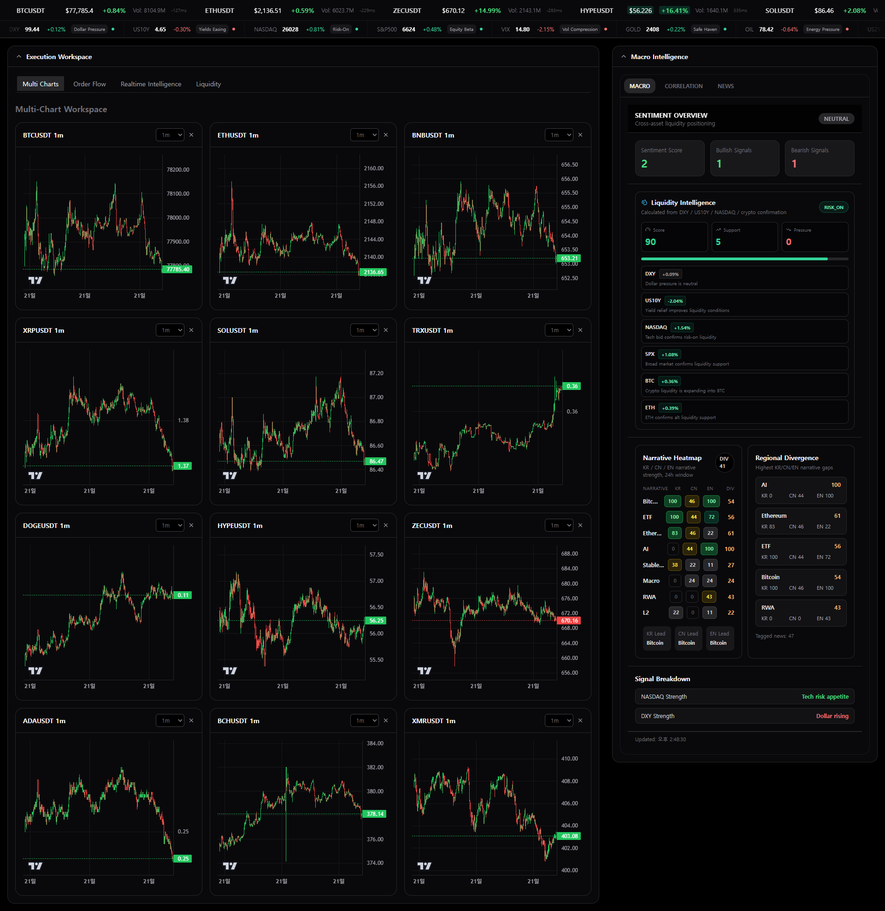

# QuantTerminal

## Realtime Crypto Market Intelligence Terminal

Narrative. Liquidity. Rotation. Intelligence.

---



> QuantTerminal is a realtime crypto market intelligence terminal focused on narrative acceleration, liquidity regimes, sector capital movement, and smart money flow.

Unlike traditional crypto dashboards that primarily visualize price data, QuantTerminal aims to surface the underlying behavioral and capital flow dynamics driving the market.

---

# Vision

Traditional dashboards answer:

- "What is the price doing?"

QuantTerminal tries to answer:

- Where is capital rotating?
- Which narratives are accelerating?
- What is smart money accumulating?
- How is liquidity affecting market structure?
- How do KR/CN/Global narratives diverge in realtime?

The goal is to build a realtime market intelligence operating system for crypto markets.

---

# Core Intelligence Systems

## Realtime Intelligence Feed

A rolling terminal-style intelligence stream that aggregates:

- narrative acceleration
- whale activity
- macro pressure
- sector rotation
- liquidity signals
- smart money flow

The system continuously transforms realtime market activity into actionable intelligence events.

---

## Narrative Intelligence

Tracks realtime narrative momentum across:

- KR retail narratives
- CN retail narratives
- Global macro/institutional narratives

Features:

- Narrative Heatmap
- Regional Divergence Detection
- Narrative Momentum
- Replayable Narrative Timeline

---

## Liquidity Intelligence

Realtime liquidity regime analysis using:

- DXY
- US10Y
- NASDAQ
- BTC Momentum
- Macro Pressure Signals

Outputs:

- Liquidity Score
- Risk-On / Risk-Off Regime
- Liquidity Drivers
- Macro Pressure Detection

---

## Sector Capital Movement

Visualizes realtime sector rotation using:

- relative performance
- volume momentum
- narrative acceleration
- whale activity
- smart money scoring

The system attempts to identify where capital is flowing before broader market recognition.

---

## Smart Money Intelligence

Aggregates:

- whale inflows
- smart money confidence
- rotation strength
- sector momentum
- narrative velocity

to generate high-confidence market signals.

---

# Regional Intelligence Layer

One of QuantTerminal's core focuses is cross-region market intelligence.

The system separates and analyzes:

| Region | Intelligence Layer |
|---|---|
| KR | Retail Narrative / Upbit Flow |
| CN | China Narrative / Jinse Flow |
| Global | Institutional / Macro Narrative |

This allows realtime detection of regional narrative divergence.

Example:

- KR → Meme acceleration
- CN → RWA momentum
- Global → AI institutional narrative

---

# Taxonomy System

QuantTerminal uses a hierarchical taxonomy system inspired by digital asset classification methodologies.

Example:

```txt
AI
 └ Agent
 └ GPU
 └ AI Infra

DeFi
 └ Lending
 └ Perp DEX
 └ Liquid Staking

Infrastructure
 └ Oracle
 └ Bridge
 └ Modular
```

The taxonomy system powers:

- sector intelligence
- narrative classification
- rotation analysis
- capital flow mapping

---

# Realtime Replay Engine

QuantTerminal includes a replayable intelligence timeline.

The replay engine reconstructs market flow events such as:

```txt
12:01 AI narrative spike
12:03 Whale inflow detected
12:06 BTC OI surge
12:08 Sector breakout
```

The goal is to replay how market narratives and liquidity evolved over time.

---

# Architecture

```txt
WebSocket Streams
        ↓
Realtime Aggregation Engine
        ↓
Narrative Intelligence Layer
        ↓
Liquidity / Macro Layer
        ↓
Sector Rotation Engine
        ↓
Realtime Intelligence Feed
```

---

# Current Features

- Realtime Intelligence Feed
- Narrative Heatmap
- Regional Divergence Detection
- Liquidity Intelligence
- Sector Capital Movement
- Whale Flow Alerts
- Smart Money Confidence
- Correlation Matrix
- Rolling Intelligence Ticker
- Replayable Narrative Timeline
- Translation-based Regional News Feed
- KR / CN / Global Narrative Separation

---

# Tech Stack

## Frontend

- Next.js
- React
- TailwindCSS
- Zustand

## Data / Infrastructure

- Binance WebSocket
- Hyperliquid Rotation Data
- Bybit Rotation Data
- Realtime Aggregation Pipelines

## Intelligence Layer

- Narrative Classification
- Liquidity Regime Detection
- Smart Money Scoring
- Regional Divergence Detection
- Sector Rotation Intelligence

---

# Philosophy

QuantTerminal is not designed to be another crypto dashboard.

The objective is to build:

- a realtime intelligence terminal
- a behavioral market analysis system
- a capital flow visualization engine
- a crypto-native operational intelligence platform

---

# Roadmap

## Intelligence Systems

- Confidence Engine
- Intelligence Graph
- Autonomous Market Analyst
- Narrative Velocity Engine
- Regional Retail Intelligence Map

## Capital Flow

- Advanced Sector Rotation Replay
- Dynamic Capital Flow Mapping
- Liquidity Flow Visualization
- Smart Money Wallet Intelligence

## Infrastructure

- WebWorker Optimization
- Realtime Aggregation Optimization
- Replay Engine Persistence
- Multi-source Intelligence Pipeline

---

# Inspiration

QuantTerminal draws inspiration from:

- Bloomberg Terminal
- Nansen
- Kaito
- Palantir Foundry
- Market Microstructure Systems
- Realtime Operational Intelligence Platforms

---

# Status

Active Development

QuantTerminal is currently evolving rapidly as an experimental realtime intelligence platform for crypto markets.

---

# License

MIT
## Phase 6 — Terminal Core Refactor

Phase 6 starts the migration from a large experimental `RegimeLab.tsx` sandbox into a reusable terminal intelligence core.

New core boundaries:

- `core/shared/metrics.ts` — shared metric helpers such as clamp, percentile, compact formatting, and direction detection.
- `core/registry/sectorRegistry.ts` — canonical sector registry with aliases, symbol mapping, weights, and descriptions.
- `core/event-bus/*` — typed terminal event stream for regime, rotation, replay, DataLab, and alert events.
- `core/alerts/*` — alert payload contracts and promotion evaluation boundary.
- `core/regime/*` — regime IDs and transition rules for the state machine.
- `core/rotation/*` — sector rotation state machine contracts and score decomposition.
- `core/replay/*` — historical snapshot and replay frame contracts.
- `core/workers/*` — message contracts for future WebWorker separation.

The current UI remains in `components/experimental/RegimeLab.tsx` so the existing DashboardLayout is not disturbed. The next cleanup pass should move calculation-heavy Phase 1–5 logic from the component into these `/core` modules.

## Phase 7 — Real Market Integration Pack

Regime Lab now includes a sandbox-only real market integration layer. It does not modify the main dashboard layout.

### Added

- `app/api/market/sector-rotation/route.ts`
  - Pulls Binance 24h tickers.
  - Pulls Upbit KRW markets/tickers for Korean retail overlay.
  - Pulls Upbit DataLab overview for premium context.
- `core/market/realMarketRotation.ts`
  - Builds live sector rotation ranking.
  - Calculates volume pressure, breadth, volatility proxy, premium boost, regime fit, confidence, and direction.
- `core/marketDataTypes.ts`
  - Shared contracts for real market rotation responses.
- Expanded `core/registry/sectorRegistry.ts`
  - AI, MEME, RWA, GAMING, DEFI, L1, INFRA, DEPIN, EXCHANGE, PAYFI.
- `components/experimental/RegimeLab.tsx`
  - Adds Phase 7 Real Market Integration panel.
  - Shows live sector ranking, coverage, leader, evidence, and top symbols.

### Philosophy

Phase 7 uses `Global rotation + Korean retail overlay` as the default architecture. Binance is treated as the global price-discovery feed, while Upbit KRW tickers and DataLab premium act as the Korea-specific sentiment overlay.

## Phase 11 — Narrative Intelligence Pack

Phase 11 adds a narrative interpretation layer on top of live sector rotation.

### Added

- `core/narrative/narrativeTypes.ts`
  - Narrative surface contracts for heatmap, story timeline, event compression, regional divergence, and operator commentary.
- `core/narrative/generateNarrativeSurface.ts`
  - Compresses sector rotation events into market narratives.
  - Infers narrative regime and tone from live sector rotation.
  - Generates AI-style market summary, narrative heatmap, story timeline, and operator commentary.
- `components/narrative/NarrativeIntelligenceSurface.tsx`
  - Live narrative panel connected to `/api/market/sector-rotation`.
  - Displays lead story, heat, tone, regional divergence, commentary, story timeline, and event compression.
- `components/DashboardLayout.tsx`
  - Adds Narrative Intelligence Surface under the Phase 10 Live Command Surface.

### Goal

Phase 11 moves the terminal from raw event visualization toward market interpretation:

`Rotation data → Narrative compression → Operator summary → Story timeline`

## Phase 13 - Signal Quality & False Positive Control

Adds a signal-quality layer on top of the narrative/rotation system.

- Scores each narrative signal using liquidity heat, news validation, sector breadth, premium confirmation, regime fit, and data quality.
- Classifies signals into `PROMOTE`, `WATCH`, and `SUPPRESS`.
- Adds false-positive risk flags and explanation reasons/penalties.
- Keeps the logic in `core/signal-quality` so the UI can be refactored later without changing scoring behavior.

## Phase 14 - Productization Surface

Adds the first user-facing product layer for daily terminal use.

- Signal Inbox for promoted/watch signals.
- Saved Views such as Korea Retail, Alt Rotation, AI Narrative, and Risk-Off.
- Watchlist mode previews for High Beta, Institutional Themes, and Korea Retail.
- Settings preview for alert threshold, cooldown, and preferred sectors.
- Explanation Drawer preview to prepare for a future detailed signal inspector.


## Realtime Market Core

The current stable realtime path uses a normalized sector rotation snapshot API:

- Binance exchangeInfo validation with in-memory TTL cache
- Chunked Binance 24h ticker fetches for active registry symbols only
- Upbit KRW market overlay
- Upbit DataLab overview context
- Diagnostics panel for connector status, coverage, latency, and invalid symbol audit

The Live Command Surface consumes this through `useSectorRotationFeed`, which handles polling, cancellation, hidden-tab suppression, and partial/error state display.
