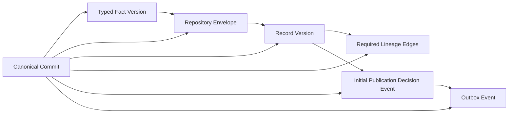
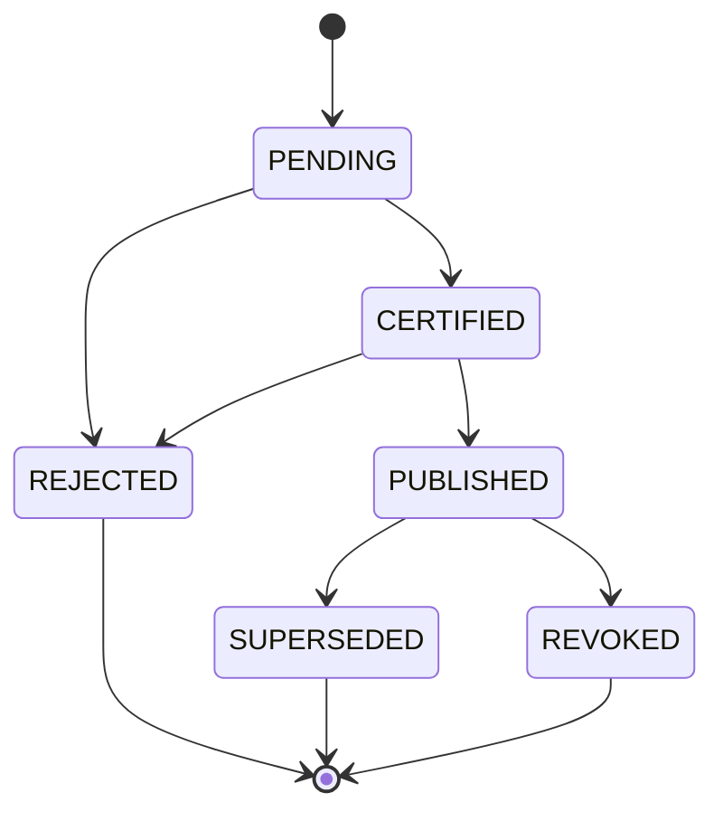

# D2 V2.1 Phase 0R - Persistence Governance Reinforcement

**Status:** Architecture approved for implementation review  
**Scope:** Canonical commit, publication lifecycle, lineage DAG, and immutable governance binding  
**Implementation:** None in Phase 0R

## 1. Current Understanding

D2 adds a canonical persistence system beside the protected generic Repository. It does not replace SQLite, alter current APIs or consumers, populate data, or activate a database connection. PostgreSQL will hold typed canonical facts and governance records; large streams remain object-storage candidates referenced by immutable manifests.

The current generic persistence system prevents overwrites but does not provide the complete D2 transaction, version, lineage, publication, or registry-snapshot model. D2 therefore introduces an additive boundary rather than extending current consumers in place.

## 2. Confirmed Phase 0 Decisions

- PostgreSQL persistence is additive and uses the existing Postgres.js driver.
- The generic Repository and SQLite remain protected and available.
- There is no immediate Repository replacement, dual write, API migration, consumer migration, UI change, or package change.
- Canonical facts and their versions are append-only.
- Provider corrections create new versions and never overwrite facts.
- Typed facts and Repository envelopes commit atomically.
- Conflicts fail closed.
- Projection and Evidence refresh are asynchronous after commit.
- Large AggTrade and Orderbook payloads remain object-storage plus manifest candidates.
- SQLite-to-PostgreSQL migration is one-way and parity-gated; cutover remains D5.

## 3. Canonical Commit Contract

A **Canonical Commit** is the immutable audit identity of one successful D2 database transaction. It is created inside the transaction and becomes visible only when that transaction commits. A rolled-back transaction has no Canonical Commit. Failed attempts may be represented separately as quarantine or operational attempt records, but must never receive a successful `commitId`.

Minimum logical contract:

| Field | Meaning |
|---|---|
| `commitId` | Globally unique, immutable transaction audit identity |
| `operationType` | Closed operation such as initial fact commit or corrected-version commit |
| `datasetId` | Governed dataset identity |
| `providerId` | Provider registration identity used by the candidate |
| `registrySnapshotId` | Exact immutable dataset-registry snapshot |
| `providerSnapshotId` | Exact immutable provider-registry and certification snapshot |
| `policyVersionId` | Exact immutable policy bundle used for validation and initial publication decision |
| `schemaVersion` | Canonical output schema version |
| `normalizationVersion` | Exact normalization definition version |
| `initiatedAt` | Candidate commit attempt start time |
| `committedAt` | Database commit boundary time |
| `idempotencyKey` | Deterministic identity for retry convergence |
| `candidateCount` | Number of candidates evaluated by this transaction |
| `committedRecordCount` | Number of immutable canonical record versions committed |

`candidateCount` and `committedRecordCount` are counts, not quality or completeness claims. The initial D2 implementation should normally commit one record version per Canonical Commit. A later bounded batch contract may allow more than one only if all records share the required governance snapshots and atomicity is intentional.

### Canonical Commit Versus Population Job

| Population Job | Canonical Commit |
|---|---|
| D3 control-plane entity | D2 persistence audit entity |
| Mutable operational progress and retry state | Immutable successful transaction identity |
| May fail, retry, pause, or partially process candidates | Exists only after a successful transaction |
| May reference zero, one, or many commits | References exactly the records committed atomically |

### Entity Relationship



The diagram expresses atomic association, not a sequence of separately durable writes. The fact, envelope, version, required lineage, initial decision event, commit entity, and outbox event either all commit or all roll back.

## 4. Publication State Machine

Publication state is independent from persistence. A committed fact version begins at `PENDING`; persistence success never promotes it further.



The safest model uses both:

1. Append-only publication decision events as the authoritative audit history.
2. A transactionally maintained current-state projection for bounded reads.

The materialized current state is derived state. It must identify the decision event that produced it and must be rebuildable from the event sequence. It cannot authorize a transition that the append-only history rejects.

## 5. Legal and Illegal Publication Transitions

| From | Legal destination | Required meaning |
|---|---|---|
| New committed version | `PENDING` | Initial state only |
| `PENDING` | `CERTIFIED` | Required quality and consistency gates passed |
| `PENDING` | `REJECTED` | Candidate version is ineligible for publication |
| `CERTIFIED` | `PUBLISHED` | Explicit publication authorization |
| `CERTIFIED` | `REJECTED` | Certification was not published and is rejected with cause |
| `PUBLISHED` | `SUPERSEDED` | A certified replacement version has been published |
| `PUBLISHED` | `REVOKED` | Published version is withdrawn for an auditable reason |

Every other transition is illegal and fails closed. In particular, `REJECTED`, `REVOKED`, and `SUPERSEDED` are terminal. Reconsideration creates a new immutable record version beginning at `PENDING`; it never resurrects the terminal version.

A correction does not immediately alter the currently published version. The correction is committed as a new `PENDING` version. The old version remains `PUBLISHED` until the replacement reaches `PUBLISHED`; the replacement publication transaction then appends the old version's `SUPERSEDED` decision. No fact row is deleted or rewritten to represent publication state.

## 6. Lineage DAG Contract

Canonical lineage is a directed acyclic graph whose semantic direction follows production dependency:

```text
Raw Artifact -> Canonical Fact Version -> Projection Version -> Evidence Packet Version
```

Each edge is append-only and must contain source identity and version, destination identity and version, relationship type, creation time, process or commit identity, and an applicable checksum or record-set digest.

Lineage prohibits:

- self edges;
- cycles;
- reverse dependency edges;
- lineage that exists only inside an opaque JSON payload;
- silent edge deletion;
- mutable edge endpoints;
- using a supersession relation as a lineage edge.

Validation is layered:

| Layer | Responsibility |
|---|---|
| Database constraints | Non-null endpoints, different source/destination, controlled types, unique edge identity, valid foreign keys, append-only rows |
| Application validation | Allowed source/destination type pairs, version compatibility, required edge set, direction, same-transaction requirements |
| Asynchronous consistency audit | Graph-wide cycle detection, missing paths, orphan nodes, digest mismatch, and cross-partition integrity |

Recursive database triggers are not required initially. Local constraints and application validation block known-invalid edges synchronously; asynchronous audits detect graph-wide defects and block publication. A detected cycle is a consistency failure, never a repair instruction.

## 7. Lineage Versus Supersession

Lineage answers **what produced this version**. Supersession answers **which immutable version this correction replaces**. They are separate relations, tables, controlled vocabularies, and validation paths.

The D1 `LineageRelationship` currently includes `SUPERSEDES`. D2 implementation must correct that ambiguity by removing supersession from the canonical lineage-edge vocabulary and introducing a dedicated supersession contract. Existing D1 code is not changed in Phase 0R. Migration compatibility must reject any attempt to treat a legacy `SUPERSEDES` lineage edge as canonical without explicit conversion and audit.

Supersession rules:

- source and replacement share the governed business identity;
- versions differ and advance according to the version policy;
- replacement has independent raw lineage and checksum;
- one version cannot supersede itself;
- supersession is append-only and cannot imply publication;
- the replaced record remains immutable and addressable.

## 8. Registry and Policy Version Binding

Every canonical fact version and Canonical Commit binds immutable references to:

- `datasetRegistrySnapshotId`;
- `providerRegistrySnapshotId`;
- `policyVersionId`;
- `schemaVersion`;
- `normalizationVersion`.

No reference resolves dynamically to `latest`. Snapshot IDs identify immutable serialized definitions with deterministic checksums. The provider snapshot includes the provider registration, certification status, dataset scope, limitations, and effective version used at commit time. The policy bundle identifies publication, quality, coverage, freshness, consistency, retention, and partition policies applicable to the dataset.

The normalization version identifies executable normalization semantics, not merely a display label. Where derived intelligence is committed, it additionally binds the exact Derived Intelligence Registry snapshot, model ID and version, input watermark, and input record-set digest.

Snapshot relationships:

| Definition | Required binding |
|---|---|
| Dataset Registry | Dataset entry and registry snapshot checksum |
| Provider Registry and Certification | Provider snapshot and certification effective at commit |
| Publication Gate | Policy bundle and gate-rule version |
| Data Quality | Policy and every evaluated rule version |
| Canonical normalization | Normalization version and output schema version |
| Derived Intelligence | Derived registry snapshot, model version, inputs, and watermark |

Missing, unreadable, checksum-invalid, revoked-for-use, or incompatible snapshots cause the candidate transaction to fail closed before canonical commit. No fallback to the current registry, inferred default, or previous policy is allowed. Already committed records retain their historical bindings even if those definitions are later superseded.

## 9. Failure and Conflict Behavior

| Condition | Required behavior |
|---|---|
| Transaction rollback | No Canonical Commit, fact, envelope, version, lineage, decision, or outbox residue |
| Exact duplicate identity and checksum | Deterministic idempotent result; no second fact or commit |
| Same identity with different checksum | Preserve raw candidate, quarantine conflict, no alternate canonical fact |
| Missing identity or raw lineage | Reject before commit |
| Invalid registry or policy snapshot | Reject before commit; never resolve to latest |
| Illegal publication transition | Reject event and leave current state unchanged |
| Missing required lineage edge | Roll back initial commit or block later publication, according to edge ownership |
| Cycle detected asynchronously | Consistency failure and publication block; no silent edge deletion |
| Provider correction | New version, new commit, new lineage, `PENDING` publication state |
| Outbox insertion failure | Roll back the canonical transaction |

Failed attempts and quarantine records may keep diagnostic metadata and immutable raw references, but must not claim a successful commit or publication.

## 10. PostgreSQL Implementation Implications

D2 implementation requires separate logical persistence for Canonical Commits, typed facts, Repository envelopes, record versions, lineage edges, supersession relations, publication decision events, current publication-state projections, immutable registry/policy snapshots, outbox events, and quarantine records.

Database constraints enforce local invariants; the canonical commit service owns the transaction. Projection and Evidence workers consume outbox events only after commit. Current-state publication reads must not replace event-history audits. Database roles must prevent application consumers from directly mutating fact versions, decision history, lineage, or snapshots.

Physical SQL types, indexes, partition details, and migration mechanics remain D2 implementation decisions constrained by this architecture. Phase 0R does not create them.

## 11. SQLite and Migration Implications

SQLite remains a development adapter and migration source. It does not need to reproduce PostgreSQL scale characteristics, but parity fixtures must preserve commit atomicity, duplicate/conflict outcomes, immutable versions, publication transitions, lineage rules, supersession separation, and snapshot binding.

Legacy generic Repository rows have no implied Canonical Commit. Migration must create auditable import commits only after canonical reserialization, checksum verification, snapshot binding, and lineage validation. Rows that cannot prove these requirements are quarantined or remain migration-source records. No dual write is introduced.

## 12. D3/D4/D5 Compatibility

- **D3 Population:** Population Jobs reference zero or more Canonical Commit IDs. Retries reuse deterministic idempotency keys. Job completion never implies publication.
- **D4 Certification:** Quality, coverage, consistency, and publication evaluators append decision events against exact fact and policy versions. D4 may certify or reject but cannot rewrite D2 facts.
- **D5 Cutover:** Consumer read models select only eligible `PUBLISHED` versions through parity-certified canonical APIs. Cutover does not change historical commit, lineage, or decision history.

## 13. Risks

| Risk | Severity | Mitigation |
|---|---|---|
| Commit confused with mutable Population Job | Critical | Separate identities, ownership, storage, and lifecycle |
| Publication inferred from persistence | Critical | Initial `PENDING` state and append-only decision events |
| D1 supersession/lineage vocabulary overlap | High | Dedicated supersession contract and explicit D2 correction |
| Dynamic registry resolution changes history | Critical | Immutable snapshot IDs and checksums; no `latest` resolution |
| Graph-wide cycles evade local checks | High | Publication-blocking asynchronous consistency audit |
| Current-state projection diverges from decisions | High | Rebuildable projection with source decision-event identity |
| Migration assigns unsupported lineage | High | Quarantine and import-commit certification |

## 14. Blockers

No architecture blocker remains for D2 implementation. The D1 `SUPERSEDES` lineage vocabulary must be corrected as an explicitly approved D2 contract change before canonical lineage persistence is certified. Physical schema design must preserve immutable snapshot bindings and publication event history.

## 15. Exact Proposed File Scope

Phase 0R creates only:

- `docs/architecture/canonical-persistence-governance-reinforcement.md`

For the later D2 implementation, the approval request must enumerate exact new persistence contracts, PostgreSQL schema/migration assets, SQLite parity bridge, object-manifest contracts, tests, ADR, architecture documents, and implementation report. It must explicitly include the bounded correction to `lib/data-platform/contracts/lineage.ts` and a new dedicated supersession contract. Existing `lib/persistence/**`, APIs, consumers, runtime, packages, lockfile, and environment configuration remain protected unless separately approved.

## 16. Phase 0R Approval Recommendation

`SAFE TO APPROVE`

The four required governance decisions are now explicit. The remaining items are implementation details and testable contract changes, not unresolved ownership or lifecycle ambiguity.
