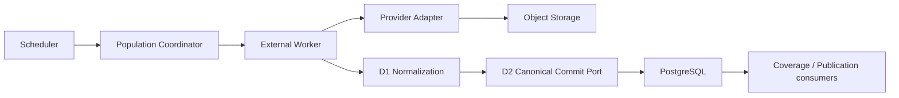
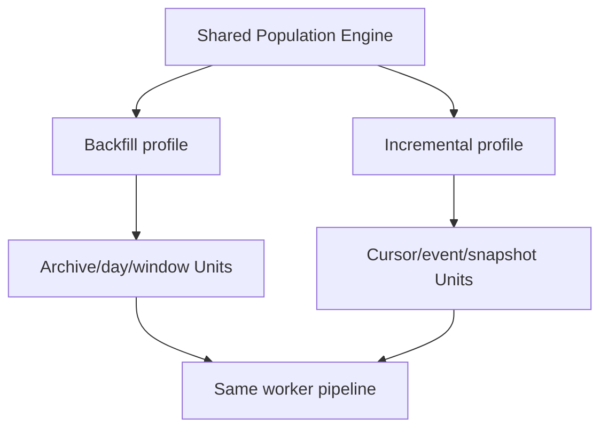

# Population Deployment Boundary

## Responsibilities

- Scheduler creates deduplicated Job requests from approved profiles and calendar triggers. It never fetches, parses, normalizes, persists facts, or publishes.
- Coordinator creates Runs and Units, manages leases/fencing, aggregates outcomes, schedules policy-controlled retries, and computes resumable state.
- Worker claims Units, retrieves and stores raw artifacts, parses candidates, runs validation and quality evaluation, invokes normalization, submits D2 commands, and records outcomes.
- Provider Adapter owns only provider capability, retrieval, parsing, source semantics, and provider error classification.
- D2 owns atomic canonical persistence only.

## Vercel Boundary

Suitable for Vercel:

- bounded authenticated Job submission;
- bounded Job/Run/Unit status reads;
- health and read-only population reports;
- short schedule trigger that inserts a Job request and returns.

Unsuitable for Vercel request execution:

- long backfills and multi-day retries;
- archive download/decompression and object transfer;
- AggTrade or Orderbook processing;
- lease-driven worker loops;
- reconciliation and graph-wide consistency scans;
- concurrency-heavy ingestion or long transactions.

Coordinator and workers require persistent external execution. PostgreSQL and object storage are shared durable services. Vercel must never own the only lease heartbeat or raw artifact copy.

## Infrastructure Alternatives

| Architecture | Correctness | Complexity | Free-tier/local fit | Recovery and scale |
|---|---|---|---|---|
| A. PostgreSQL-driven queue | Strong durable audit and simple idempotent claims | Lowest initial operational complexity | Good local development; modest workloads fit one database | Recoverable from database state; polling load limits scale |
| B. External queue-driven | Delivery and scale are strong | Requires queue plus separate durable audit reconciliation | More vendor setup; local emulation needed | Queue loss/redelivery must reconcile with PostgreSQL |
| C. Hybrid | PostgreSQL truth with queue acceleration | Highest initial complexity | Can begin database-only and add queue later | Best scale and queue-loss recovery when designed carefully |

Recommendation: implement Option A first with interfaces compatible with Option C. PostgreSQL owns Jobs, Runs, Units, outcomes, and leases. A future queue carries Unit IDs only and never becomes canonical operational truth.

## Backfill and Incremental Profiles

Option B, one engine with different Job profiles, is recommended. Separate engines duplicate identity, retry, and quality behavior. Translating every backfill into incremental polling loses archive and provider-partition semantics. Shared orchestration with dataset-specific Unit generators preserves both.

## Security and Secrets

- Provider keys belong to provider-adapter worker identities and are never exposed to browsers or persisted in attempts.
- Internal-web ephemeral keys remain request-scoped, explicitly enabled, mapping-gated, and non-persistent.
- Object-storage credentials are worker-only and limited to governed prefixes.
- Canonical worker credentials can invoke approved D2 operations but cannot migrate schemas or mutate facts directly.
- Scheduler credentials can create Job requests only.
- Status APIs use read-only credentials.
- Migration credentials remain separate and unavailable to runtime services.
- Preview and production use separate databases, buckets, roles, and provider keys.
- Logs redact authorization, cookies, query secrets, connection strings, and raw sensitive payloads.

## Observability

Durable records, not logs alone, must cover Job, Run, Unit, Retrieval Attempt, Manifest, Candidate, Validation Result, Quality Result, Canonical Commit Result, Publication Result, Retry Event, Lease Event, Watermark Decision, and Coverage Decision.

Correlation uses explicit references without identity conflation. Metrics include throughput, retrieval and commit latency, parse/validation failure, duplicate/conflict rates, outbox and watermark lag, lease expiry, and retry exhaustion. Alert thresholds remain policy work.
