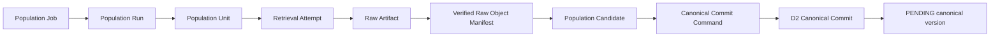

# Population Domain Model

## Core Model



## Entities and Cardinality

### Population Job

A Job is a mutable operational request for a logical body of work under one immutable job specification and policy snapshot. Its deterministic identity is derived from the job profile plus ordered dataset/provider/dimension/window inputs. Resubmitting the same logical request returns the existing active or completed Job unless an explicit new policy/profile version changes the identity.

One Job has one or more Runs and one or more Units. Scheduler timing is request metadata, never canonical truth.

### Population Run

A Run is one observable execution attempt of a Job. It has a unique `runId`, positive `attemptNumber`, worker/coordinator identity, lease version, start/heartbeat/completion timestamps, terminal outcome, retry classification, and aggregate checkpoint. A retry creates a new Run; it does not rewrite the failed Run.

### Population Unit

A Unit is the smallest independently leased, retried, and reconciled work partition. Its deterministic identity includes only dimensions declared by the dataset job profile: dataset, provider, venue where applicable, subject/symbol where applicable, bounded UTC window or provider partition, resolution where applicable, and profile version.

There is no universal symbol/day formula. Funding may use event windows, OHLCV archive partitions, snapshots a subject/window, and streams object partitions.

One Unit produces zero or more Retrieval Attempts, zero or one accepted Raw Artifact for an attempt, zero or one manifest per unique artifact, zero or many Candidates, and zero or many Canonical Commit outcomes. A stream Unit normally produces one stream-manifest Candidate rather than one candidate per tick.

### Retrieval Attempt

A Retrieval Attempt is an immutable record of one provider interaction. Repeated network requests receive distinct attempt IDs even when they serve the same Unit. It records request metadata safe for audit, response classification, provider status, rate-limit hints, bytes/hash when received, and error classification. Secrets and full sensitive headers are excluded.

### Raw Artifact and Manifest

The Raw Artifact is exact provider material. Its identity is content-addressed. The PostgreSQL Raw Object Manifest records verification and storage metadata but never stores large raw bytes. `VERIFIED` means the object exists at the declared key, its content hash and size match, and required provider/snapshot metadata validates. Retrieval success alone does not imply verification or usability.

### Population Candidate

A Candidate is immutable parsed source material plus eligibility state. It contains a deterministic `candidateId`, Unit and raw manifest references, source observation identity and timestamps, parser version, dataset/provider bindings, structural and semantic validation references, quality evaluation references, candidate checksum, normalization eligibility, and bounded typed candidate content.

Candidates are dataset-specific discriminated unions. They are not generic JSON facts and are never published.

### Canonical Commit

One eligible Candidate maps to exactly one D2 Canonical Commit command in the initial architecture. This preserves isolated rollback, precise duplicate/conflict attribution, and simple retry reconciliation. A Job or Unit may therefore reference many immutable commits; neither is a commit.

## Identity Model

```text
jobId != runId != unitId != retrievalAttemptId != rawObjectId
      != candidateId != canonicalRecordId != commitId
```

- `jobId`: deterministic logical request and job-profile version.
- `runId`: unique execution attempt; retries are distinct.
- `unitId`: deterministic bounded work identity.
- `retrievalAttemptId`: unique provider interaction.
- `rawObjectId`: deterministic content address.
- `candidateId`: deterministic from parser version, raw object, source identity, and ordered candidate boundary.
- `canonicalRecordId`: D1/D2 deterministic business identity.
- `commitId`: D2 transaction identity; retry behavior follows the D2 contract.

Idempotency keys coordinate retries but replace none of these identities.

## Closed Outcomes

Candidate/Unit outcomes are:

- `COMMITTED`: D2 created a new immutable version.
- `DUPLICATE`: D2 found identical canonical identity and checksum; successful processing without a new version.
- `CONFLICT`: incompatible immutable content; quarantined and blocks relevant progress.
- `QUARANTINED`: retained for explicit review due to validation, quality, or policy failure.
- `UNSUPPORTED`: adapter or governed capability does not support the request.
- `EMPTY`: a valid provider response contained no observations; never converted to zero-valued facts.
- `RETRYABLE_FAILURE`: policy permits another Run/attempt.
- `PERMANENT_FAILURE`: no automatic retry under the bound policy.
- `CANCELLED`: stopped by a valid fenced cancellation.
- `SKIPPED_BY_POLICY`: intentionally not attempted under an immutable policy decision.

`DUPLICATE` is eligible as processed. `CONFLICT` is never success.

## Job and Run States

Job current state is a controlled projection over append-only events:

`QUEUED`, `RUNNING`, `SUCCEEDED`, `PARTIAL`, `FAILED`, `CANCELLED`, `PAUSED`, or `EXPIRED`.

Runs terminate as `SUCCEEDED`, `PARTIAL`, `FAILED`, `CANCELLED`, or `EXPIRED`. A Job is `SUCCEEDED` only when every required Unit has a terminal policy-acceptable outcome. It is `PARTIAL` when durable successes coexist with unresolved or failed required Units.

## Provider Adapter Contract

An adapter owns capability probing, request construction, retrieval, raw metadata, parsing, source identity/timestamp semantics, provider error classification, rate-limit metadata, and retry hints. It may emit typed candidates but may not write canonical data, update coverage, publish, score confidence, silently repair gaps, or bypass normalization.

Provider tier controls operational eligibility and policy selection. It is not confidence. Experimental adapters require explicit profile enablement, immutable mappings, and certification bindings.

## Validation and Quality

Validation layers are transport, structural, provider-semantic, canonical eligibility, and cross-record validation. Their results are factual pass/fail/error records.

Quality evaluation is a separate D1 policy-bound run. Low quality is not malformed data; inconsistency is not missing coverage. Blocking results prevent normalization/commit and retain the candidate. Advisory results remain linked to the candidate and future publication evaluation. Policy re-evaluation appends a new evaluation result; it does not create a canonical version unless normalized fact content or governed version bindings require a new commit.

## Normalization

Normalization is selected from immutable registry bindings and receives typed candidate data, source identity/timestamps, raw manifest, parser version, schema version, and normalization version. It is deterministic, side-effect free, and returns a typed D2 fact plus ordered identity/serialization inputs. Workers cannot contain ad hoc normalization.
