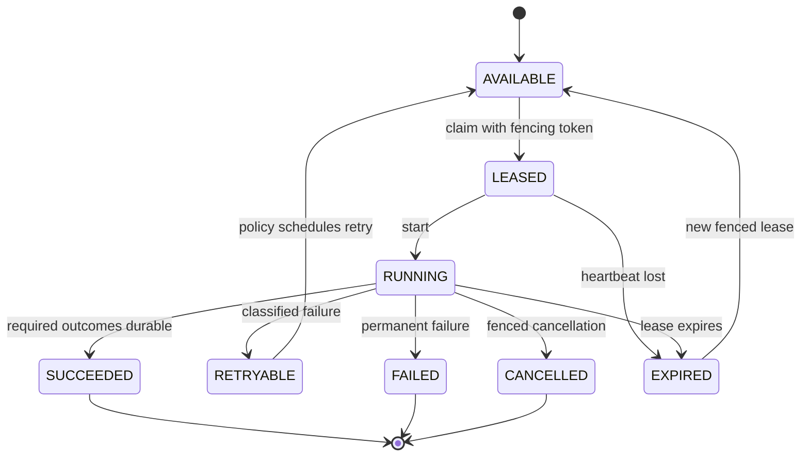

# Population Retry and Checkpointing

## Execution Model

D3 uses at-least-once execution, deterministic identities, durable outcomes, and fenced leases. It does not claim exactly-once execution.

## Lease Recommendation

Use PostgreSQL row leases for the initial production architecture:

- claim with `FOR UPDATE SKIP LOCKED` in a short transaction;
- increment a monotonic fencing token on every lease;
- store owner, acquired time, expiry, and heartbeat;
- require `unitId + leaseVersion + ownerId` on every mutable operational update;
- reject stale updates after lease loss;
- never hold a database transaction while calling a provider or object store.

Advisory locks alone do not provide durable ownership or fencing. External queues improve delivery scale but cannot replace durable audit state. A later hybrid may publish ready Unit IDs to a queue while PostgreSQL remains authoritative.

## Checkpoints

Checkpoints are immutable events plus a materialized current pointer. They may identify the last completed archive partition, page/cursor, object byte boundary where safely resumable, or completed candidate range. A checkpoint cannot claim canonical success; it references durable Unit outcomes and commits.

For archive datasets, the safest initial Unit is one provider archive partition, avoiding byte-level resume complexity. For paginated APIs, a checkpoint stores the provider cursor only after the page artifact and its outcomes are durable. Streams checkpoint immutable object manifests and sequence ranges.

## Retry Classification

Retry counts and delays are policy-controlled; Phase 0 defines no numbers.

| Condition | Class | Retry owner | Checkpoint / quarantine behavior |
|---|---|---|---|
| DNS/network interruption, timeout | Retryable | Coordinator creates new Run/attempt | Keep last durable checkpoint |
| HTTP 429 | Retryable when provider supplies or policy permits | Coordinator | Preserve rate-limit metadata; honor governed retry hint |
| HTTP 5xx | Retryable by policy | Coordinator | New Retrieval Attempt |
| HTTP 4xx authentication/authorization | Permanent until operator/config change | Coordinator stops Unit | Audit without secret values |
| HTTP 404 archive absent | `EMPTY`, `UNSUPPORTED`, or permanent according to capability contract | No blind retry | Preserve attempt; never claim zero facts |
| Provider capability unsupported | Unsupported | No retry | Durable policy outcome |
| Empty valid response | Empty | Policy decides later probe | No fact and no fabricated coverage |
| Malformed payload/decompression/parser failure | Permanent for artifact; possibly retry retrieval if transport corruption proven | Worker/coordinator | Retain raw object; quarantine candidate/artifact |
| Checksum mismatch | Permanent for object instance | Worker | Verification failed; quarantine |
| Schema/registry/certification missing | Policy-blocked | Coordinator after governance change only | Fail closed; candidate retained |
| Structural/provider-semantic validation failure | Permanent candidate failure | No automatic content repair | Quarantine |
| Blocking quality result | Policy-rejected | Re-evaluate only under explicit policy run | Candidate retained |
| D2 duplicate | Successful idempotent outcome | No retry | Eligible for progress evaluation |
| D2 conflict | Terminal pending reconciliation | No automatic retry | Quarantine; block watermark |
| PostgreSQL deadlock/serialization/connection interruption | Retryable with same idempotency key | D2/worker under bound policy | Reconcile unknown outcome first |
| Worker crash or lease expiry | Retryable | Coordinator | New Run or claim; stale worker fenced |
| Cancellation | Cancelled | Coordinator | Stop new work; preserve durable success |

## Run and Retry Semantics

Network retries inside one provider call are discouraged because they hide Retrieval Attempts. Each externally observable request is its own attempt. A new worker execution after failure or lease expiry creates a new Run attempt. The same deterministic Unit and Candidate identities are reused.

## Partial Failure

One Job can process many Units. Each Unit outcome is independent. Required unresolved Units prevent a `SUCCEEDED` Job and prevent a watermark from skipping their boundary. Retry selects failed or expired Units without recreating completed Units. Conflicts stay visible until an explicit reconciliation event resolves them.

## Cancellation

Cancellation is a requested state, not immediate proof that work stopped. The worker checks it before retrieval, before candidate processing, and before D2 submission. A fenced D2 submission already committed remains valid. After lease loss, all operational writes fail even if the old worker continues executing locally.
