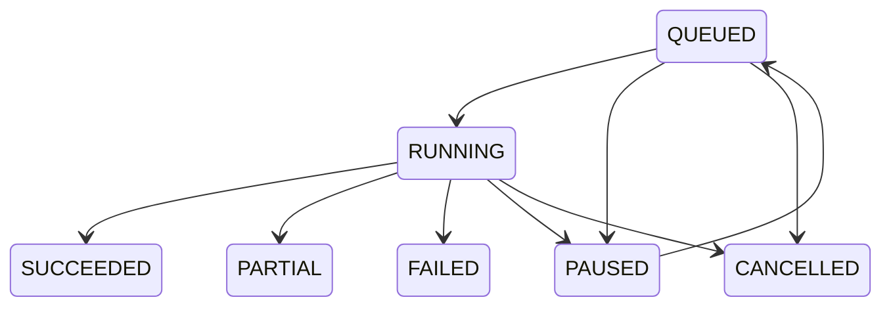

# Population State Machines

## Job



`EXPIRED` is allowed from active pre-terminal states. Terminal states do not transition. Job aggregate state is derived from required Unit outcomes: all completed is `SUCCEEDED`; mixed completed and terminal failure is `PARTIAL`; all required terminal failures is `FAILED`.

## Run

`CREATED -> RUNNING -> SUCCEEDED | PARTIAL | FAILED | CANCELLED | EXPIRED`. Retries create a new Run.

## Unit

```text
PENDING -> LEASED -> RETRIEVING -> RAW_PERSISTED
-> CANDIDATES_READY -> PROCESSING -> COMPLETED
```

Active stages may route to `RETRYABLE`, `QUARANTINED`, `FAILED`, or `CANCELLED` where explicitly permitted. `RETRYABLE -> LEASED` requires a new fenced lease. Terminal states do not reopen.

Every illegal transition fails closed. Current-state columns are not historical truth; append-only events reconstruct the state.
