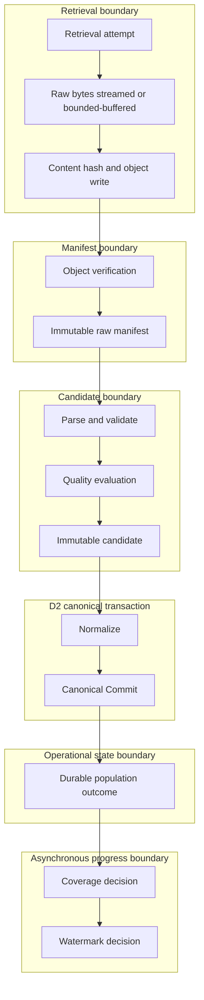

# Population Transaction Boundaries

## Boundary Map



## Atomic and Eventual Guarantees

| Boundary | Guarantee | Crash recovery |
|---|---|---|
| Retrieval | Attempt record is durable independently of success; accepted bytes are immutable | Retry creates a new Retrieval Attempt for the same Unit |
| Object write | Object key is content-addressed and write is verified before use | Existing matching object is idempotent; mismatch fails closed |
| Manifest | Manifest registration is immutable and references exact snapshots | Missing or unverified object blocks candidate eligibility |
| Candidate | Candidate, validation references, and quality references are durable | Deterministic candidate identity makes replay idempotent |
| Canonical Commit | D2 atomically persists fact, envelope, version, lineage, decision, and outbox | Reconcile unknown outcomes by idempotency/canonical identity before retry |
| Population outcome | Records the D2 result after commit returns or reconciliation resolves it | If crash occurs after D2 commit, recovery reconciles and appends outcome |
| Coverage/watermark | Separate controlled transactions derived from durable outcomes | Recompute from immutable outcomes; never infer from mutable Job state |

Scheduler, Job progress, Coverage, Projection, Evidence, and publication are excluded from the D2 transaction.

## Canonical Commit Integration

The Population Engine depends on a narrow `CanonicalCommitPort` whose behavior is the D2 result union. Provider adapters and consumers never import PostgreSQL clients, SQL types, or D2 tables.

Sequence:

1. Resolve immutable dataset, provider, certification, policy, schema, and normalization snapshots.
2. Require a verified raw manifest.
3. Persist candidate validation and quality results.
4. Run the registered pure normalizer.
5. construct one bounded `CanonicalCommitCommand` for one candidate.
6. Submit using deterministic identity and retry idempotency.
7. Record `COMMITTED`, `DUPLICATE`, `CONFLICT`, `REJECTED`, or retryable failure as an immutable outcome.
8. Quarantine conflicts and blocked candidates without advancing progress.

## Raw Artifact Flow

```text
Provider response
  -> exact immutable bytes
  -> SHA-256 content hash
  -> object storage write
  -> read-after-write/hash verification
  -> Raw Object Manifest VERIFIED
  -> candidate parsing
```

Large archives, AggTrade, Orderbook, documents, and streams must be streamed to object storage. Memory buffering is allowed only when a dataset policy defines a bounded maximum and the observed `Content-Length` or streamed count remains within it. D3 Phase 1 must define the configurable limit; Phase 0 invents no byte threshold.

Object keys are derived from environment, provider, dataset, content hash, and immutable object identity. They do not rely solely on mutable dates or filenames. Compression and media type are source metadata; decompression creates a related derived raw object or verified processing artifact rather than overwriting the source.

## Object Storage Options

| Option | Advantages | Disadvantages | Fit |
|---|---|---|---|
| Managed blob storage such as Vercel Blob | Low setup, simple preview integration | Tighter platform coupling; worker egress and large archive economics require review | Small bounded artifacts and preview |
| S3-compatible storage | Streaming, lifecycle policies, broad worker support, vendor portability | More credentials and operational configuration | Recommended production abstraction |
| Local filesystem | Simple development and deterministic fixtures | Ephemeral on serverless, not shared, not production durable | Development only |

Use a provider-neutral object port initially, with S3-compatible semantics as the production reference. Provider selection remains a deployment decision.

## Coverage and Watermark Decisions

The safe order is:

```text
Canonical Commit resolves
  -> Population outcome is durable
  -> required Unit set is evaluated
  -> Coverage decision is appended
  -> Watermark decision is appended
  -> current projections update
```

A watermark never advances for a rolled-back or unknown commit, conflict, unresolved required Unit, blocking validation/quality result, missing required interval, or unavailable provider period. A duplicate may count as processed because the canonical fact already exists. `EMPTY`, `UNSUPPORTED`, and `SKIPPED_BY_POLICY` affect progress only according to an explicit bound policy and cannot imply factual coverage.

Watermark keys are dataset-profile-specific combinations of dataset, provider, venue, subject/symbol, resolution, partition, and profile version. Kinds remain those governed by D1: timestamp, provider cursor, archive partition, sequence, AggTrade ID, or object manifest.

## Publication Interaction

Population ends with D2 `PENDING`. Certification and publication are asynchronous. D3 may schedule a publication-gate evaluation request, but it does not decide facts are publishable itself. Automatic certification is permitted only if a future approved publication policy explicitly defines it. Corrections and policy changes require new evaluations; providers cannot publish directly.

## Partial Batches

Successful Units and commits remain durable. Failed Units do not roll back unrelated work. Job status becomes `PARTIAL` when required work is mixed. Resume selects only unresolved or retryable Units and relies on deterministic identities to avoid duplicate facts. Cancellation stops new claims but does not erase successful commits.
