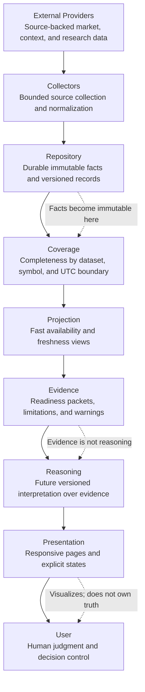

# DGM-001 System Context

**Status:** Canonical Mermaid source  
**Owner:** Architecture  
**Purpose:** Show the highest-level QuantTerminal flow from source providers to the user.  
**Responsibilities:** Establish the permanent layer order and prevent downstream layers from bypassing upstream evidence boundaries.  
**Inputs:** Provider-backed facts, source metadata, validation results, repository records, projections, evidence packets.  
**Outputs:** User-facing understanding through presentation surfaces.  
**Related ADRs:** ADR-001 Repository First, ADR-004 Evidence Never Bypasses Repository, ADR-005 Separation Of Evidence And Reasoning, ADR-007 Visualization First.  
**Related MASTER documents:** `MASTER_PLAN.md`, `MASTER_ARCHITECTURE.md`.  

