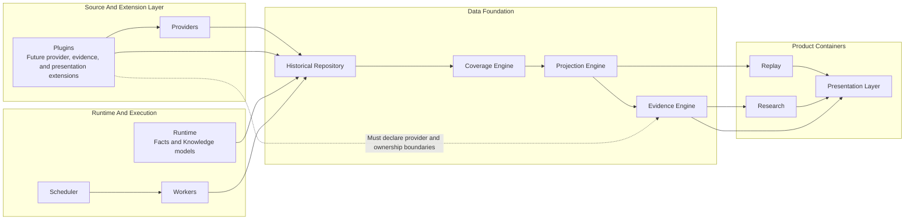

# DGM-002 Container Architecture

**Status:** Canonical Mermaid source  
**Owner:** Architecture  
**Purpose:** Show the major QuantTerminal containers and their ownership boundaries.  
**Responsibilities:** Keep repository, runtime, execution, evidence, product, and plugin concerns separated.  
**Inputs:** Canonical facts, operational plans, repository projections, evidence metadata, plugin contracts.  
**Outputs:** Bounded product reads, evidence packets, future reasoning inputs, and user-facing visualization.  
**Related ADRs:** ADR-001 Repository First, ADR-003 Coverage Via Projection, ADR-006 Provider Independence, ADR-007 Visualization First.  
**Related MASTER documents:** `MASTER_PLAN.md`, `MASTER_ARCHITECTURE.md`.  

