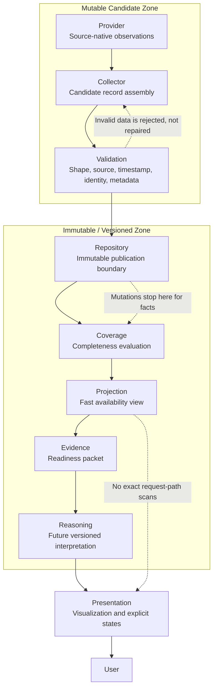

# DGM-004 Canonical Data Flow

**Status:** Canonical Mermaid source  
**Owner:** Architecture  
**Purpose:** Show the canonical lifecycle of data and where mutability stops.  
**Responsibilities:** Define the durable path from provider facts to user-facing presentation without hidden interpretation.  
**Inputs:** Provider observations, collector candidates, validation outcomes, repository facts, projection metadata, evidence packets.  
**Outputs:** Presentation state and future reasoning outputs bounded by evidence.  
**Related ADRs:** ADR-001 Repository First, ADR-002 Immutable Historical Facts, ADR-003 Coverage Via Projection, ADR-005 Separation Of Evidence And Reasoning.  
**Related MASTER documents:** `MASTER_PLAN.md`, `MASTER_ARCHITECTURE.md`.  

