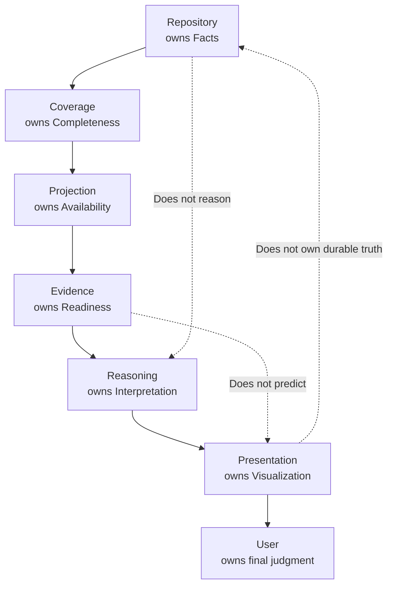

# DGM-005 Ownership Model

**Status:** Canonical Mermaid source  
**Owner:** Architecture  
**Purpose:** Show the exact ownership chain for facts, completeness, availability, readiness, interpretation, and visualization.  
**Responsibilities:** Prevent ownership conflicts and clarify where future work belongs.  
**Inputs:** Master architecture ownership model, repository facts, coverage results, projection lifecycle, evidence packets.  
**Outputs:** Single-owner responsibility map for implementation and review.  
**Related ADRs:** ADR-001 Repository First, ADR-003 Coverage Via Projection, ADR-005 Separation Of Evidence And Reasoning, ADR-007 Visualization First.  
**Related MASTER documents:** `MASTER_PLAN.md`, `MASTER_ARCHITECTURE.md`.  

