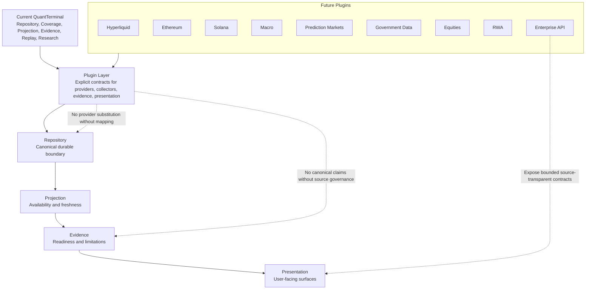

# DGM-007 Plugin Architecture

**Status:** Canonical Mermaid source  
**Owner:** Architecture / Expansion  
**Purpose:** Show how future providers and domains plug into the existing architecture without bypassing source governance.  
**Responsibilities:** Define plugin entry boundaries for future market, macro, enterprise, and reasoning extensions.  
**Inputs:** Current architecture contracts, provider capability mappings, plugin manifests, source governance rules.  
**Outputs:** Repository-backed datasets, projected availability, evidence packets, presentation modules, future reasoning inputs.  
**Related ADRs:** ADR-001 Repository First, ADR-004 Evidence Never Bypasses Repository, ADR-006 Provider Independence, ADR-007 Visualization First.  
**Related MASTER documents:** `MASTER_PLAN.md`, `MASTER_ARCHITECTURE.md`.  

