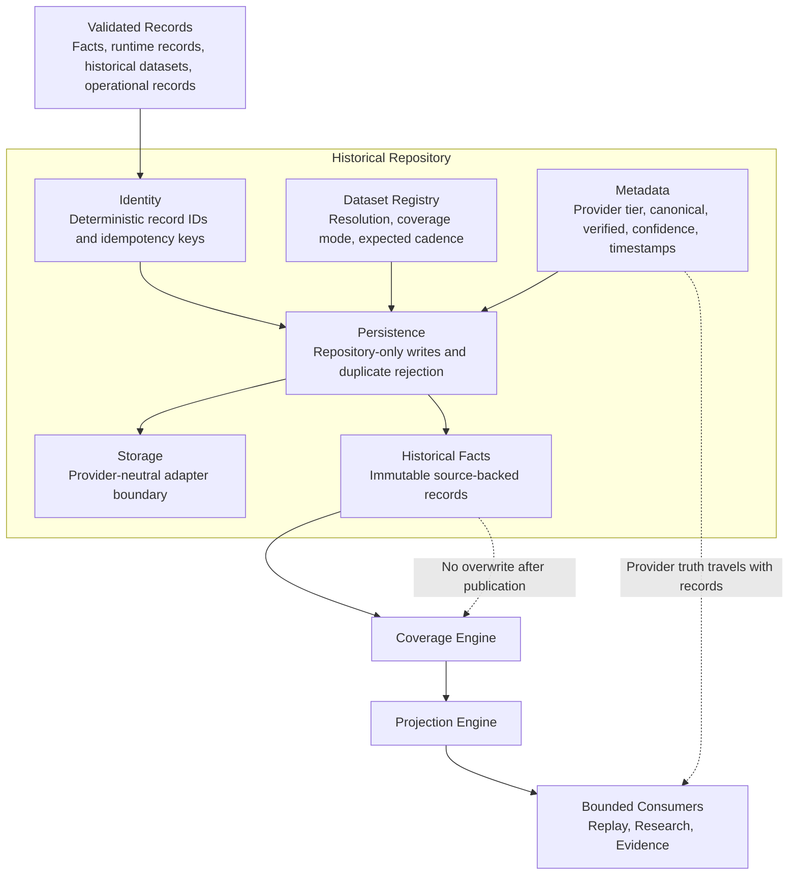

# DGM-003 Repository Components

**Status:** Canonical Mermaid source  
**Owner:** Architecture / Data  
**Purpose:** Show the internal responsibilities of the Historical Repository.  
**Responsibilities:** Preserve durable source-backed facts, deterministic identity, provider metadata, and dataset contracts.  
**Inputs:** Validated facts, runtime records, historical market records, operational records, provider metadata.  
**Outputs:** Repository records, bounded reads, parent lineage, coverage inputs, projection inputs.  
**Related ADRs:** ADR-001 Repository First, ADR-002 Immutable Historical Facts, ADR-006 Provider Independence.  
**Related MASTER documents:** `MASTER_PLAN.md`, `MASTER_ARCHITECTURE.md`.  

