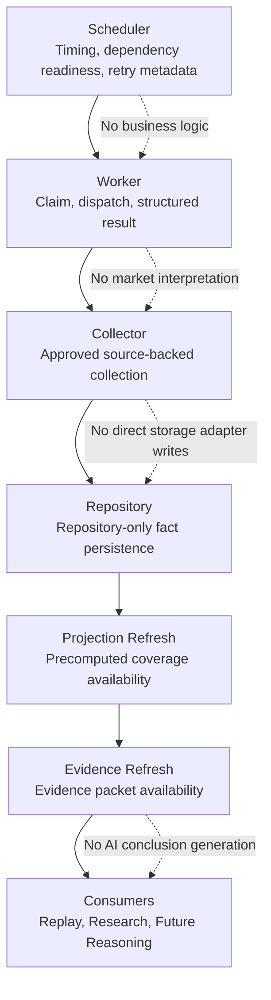

# DGM-006 Runtime Flow

**Status:** Canonical Mermaid source  
**Owner:** Architecture / Engineering  
**Purpose:** Show the execution path for scheduled or manual runtime work without embedding business logic in execution layers.  
**Responsibilities:** Clarify Scheduler, Worker, Collector, Repository, Projection Refresh, and Evidence Refresh ownership.  
**Inputs:** Execution plans, ready jobs, source collection requests, repository facts, projection refresh candidates.  
**Outputs:** Repository records, refreshed projections, refreshed evidence packets, structured execution results.  
**Related ADRs:** ADR-001 Repository First, ADR-003 Coverage Via Projection, ADR-004 Evidence Never Bypasses Repository, ADR-005 Separation Of Evidence And Reasoning.  
**Related MASTER documents:** `MASTER_PLAN.md`, `MASTER_ARCHITECTURE.md`.  

