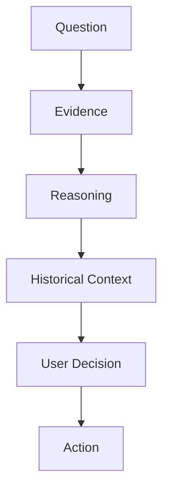

# PDGM-111 Decision Flow Blueprint

## Blueprint Metadata

| Field | Value |
| --- | --- |
| Blueprint ID | PDGM-111 |
| Version | v1.0 |
| Owner | Product / Decision Support |
| Dependencies | MASTER_PRODUCT, MASTER_ARCHITECTURE, Evidence Card Blueprint, Information Architecture |
| Related MASTER documents | MASTER_PLAN, MASTER_ARCHITECTURE, MASTER_PRODUCT, MASTER_ENGINEERING |
| Related diagrams | DGM-004 Canonical Data Flow, DGM-005 Ownership Model |
| Status | Canonical |
| Review cycle | Review with every reasoning, evidence, trade, research, or automation change |

## 1. Purpose

Decision Flow defines how QuantTerminal helps users move from question to action while preserving human authority.

Primary user question: How do I move from uncertainty to a user-owned decision?

Expected user outcome: The user can inspect evidence, review reasoning, compare historical context, make a decision, and choose an action without unsupported automation.

## 2. Inputs

| Input | Role |
| --- | --- |
| Repository | Source of raw facts and lineage. |
| Evidence | Required before reasoning or action. |
| Reasoning | Future interpretation layer that must reference evidence. |
| Research | Deep explanation and counter-evidence. |
| Replay | Historical event context. |
| Signals | Candidate prompts, never final decisions. |
| Historical Context | Analog and prior-event support. |
| Macro | Optional evidence when source-backed. |
| Prediction Markets | Optional expectation evidence when source-backed. |
| User Preferences | Risk preference, workspace, density, saved context. |

## 3. Outputs

The user can decide whether to ignore, monitor, investigate, prepare a trade, save research, or export context.

The user gains a traceable path from question to evidence to reasoning to decision.

## 4. Information Hierarchy

Level 1: Question  
Defines the user problem before data is displayed.

Level 2: Evidence  
Shows source-backed facts and availability.

Level 3: Reasoning  
Explains possible interpretation while referencing evidence.

Level 4: Historical Context  
Shows comparable prior behavior when available.

Level 5: Decision  
Keeps the final judgment with the user.

Level 6: Action  
Supports monitoring, replay, research, export, alerting, or trade preparation.

## 5. User Journey

Entry: User starts with a market question, Evidence Card, scanner candidate, replay event, or research thesis.

Primary workflow: Clarify question, inspect evidence, review reasoning, compare history, decide, and act.

Secondary workflow: Seek counter-evidence, open Repository, save workspace, or defer.

Exit: User takes a chosen action or marks the decision unresolved.

Context preservation: The decision path should preserve evidence, reasoning, historical context, and user-selected action.

## 6. Interaction Model

Click: Move to the next decision stage or open supporting detail.

Hover: Reveal source, confidence, and limitation details.

Expand: Show counter-evidence, historical context, and repository lineage.

Drill-down: Evidence to Repository, reasoning to Research, history to Replay.

Cross-navigation: Flow can begin from Dashboard, Scanner, Replay, Research, Markets, or Trade.

Search: Find evidence, historical context, and research supporting the decision.

Filtering: Narrow by confidence, availability, provider tier, event type, or time.

Workspace: Preserve the decision trail.

Saved Views: Store decision context without converting it into a fact.

## 7. Dependencies

Decision Flow depends on Evidence Cards, Information Architecture, Repository lineage, Research, Replay, and MASTER_PRODUCT human authority principles.

It must not bypass MASTER_ARCHITECTURE separation of evidence and reasoning.

## 8. Success Criteria

- The user always sees evidence before reasoning.
- The user can identify unsupported or missing evidence.
- The final decision remains user-owned.
- Actions are traceable to evidence and context.
- No screen shortcuts directly from claim to action.

## 9. DO

- Always start from a clear question.
- Always show evidence before reasoning.
- Always reveal limitations and counter-evidence.
- Always preserve the decision trail.
- Always keep the user as final authority.

## 10. DO NOT

- Do not shortcut from signal to action.
- Do not present AI conclusions without evidence.
- Do not hide uncertainty.
- Do not fabricate historical context.
- Do not imply trade execution authority.

## 11. Future Expansion

Decision Flow may evolve toward AI-assisted navigation, scenario planning, collaborative decision trails, enterprise approvals, and automation suggestions.

Future expansion must keep human authority and evidence traceability intact.

