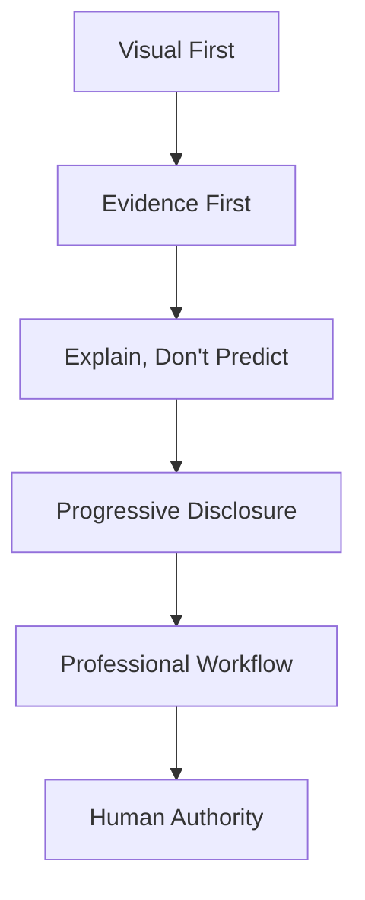

# PDGM-112 Design DNA Blueprint

## Blueprint Metadata

| Field | Value |
| --- | --- |
| Blueprint ID | PDGM-112 |
| Version | v1.0 |
| Owner | Product / Design System |
| Dependencies | MASTER_PRODUCT, Design DNA, Product Pattern Library, Anti Pattern Library |
| Related MASTER documents | MASTER_PLAN, MASTER_ARCHITECTURE, MASTER_PRODUCT, MASTER_ENGINEERING, MASTER_ROADMAP |
| Related diagrams | DGM-001 System Context, DGM-005 Ownership Model |
| Status | Canonical |
| Review cycle | Review with every design system, major screen, product principle, or visual language change |

## 1. Purpose

Design DNA defines how QuantTerminal should feel, behave, and communicate across every product surface.

Primary user question: Can I trust this product to help me understand markets clearly?

Expected user outcome: The user experiences QuantTerminal as visual, evidence-first, professional, calm, and decision-supportive.

## 2. Inputs

| Input | Role |
| --- | --- |
| Repository | Grounds design in traceable facts. |
| Evidence | Primary product communication layer. |
| Reasoning | Future interpretation layer constrained by evidence. |
| Research | Deep understanding surface. |
| Replay | Visual historical explanation surface. |
| Signals | Candidate prompts that require evidence. |
| Historical Context | Contextual comparison when source-backed. |
| Macro | Optional evidence category. |
| Prediction Markets | Optional evidence category. |
| User Preferences | Accessibility, density, workspace, and personalization. |

## 3. Outputs

The user can recognize consistent product behavior across screens.

The user can trust that evidence precedes reasoning, visuals support understanding, and the product never uses unsupported certainty.

## 4. Information Hierarchy

Level 1: Visual First  
Important meaning appears visually before long-form explanation.

Level 2: Evidence First  
Facts, sources, timestamps, and limitations precede interpretation.

Level 3: Explain, Don't Predict  
The product supports understanding rather than selling certainty.

Level 4: Progressive Disclosure  
Depth expands when the user asks for it.

Level 5: Professional Workflow  
The product supports repeated, efficient market work.

Level 6: Human Authority  
The user remains responsible for decisions.

## 5. User Journey

Entry: User enters any screen and should immediately recognize the QuantTerminal product language.

Primary workflow: Scan visual state, inspect evidence, expand depth, compare context, and decide next action.

Secondary workflow: Switch density, save workspace, search, or open Repository-backed detail.

Exit: User leaves with clearer understanding and traceable context.

Context preservation: Design should visually preserve symbol, time, evidence, and state across product surfaces.

## 6. Interaction Model

Click: Move deeper through evidence and context.

Hover: Reveal precise source and limitation details.

Expand: Support progressive disclosure.

Drill-down: Connect visual summary to evidence and raw facts.

Cross-navigation: Maintain consistent context behavior.

Search: Support direct entry without bypassing evidence.

Filtering: Refine evidence without hiding uncertainty.

Workspace: Preserve professional workflows.

Saved Views: Preserve layout and context, not unsupported conclusions.

## 7. Dependencies

Design DNA depends on MASTER_PRODUCT, MASTER_PLAN, MASTER_ENGINEERING, the Pattern Library, Anti Pattern Library, and Information Architecture.

It constrains all future design systems, product diagrams, Figma work, and frontend implementation.

## 8. Success Criteria

- Every screen feels related without becoming visually repetitive.
- Users see evidence before conclusions.
- Visual hierarchy reduces cognitive load.
- Unavailable, stale, experimental, and partial states are clear.
- Professional users can work efficiently without sacrificing beginner clarity.

## 9. DO

- Always prioritize visual understanding.
- Always show evidence and source state.
- Always preserve progressive disclosure.
- Always use consistent terminology and interaction patterns.
- Always respect human decision authority.

## 10. DO NOT

- Do not use decoration as a substitute for information.
- Do not create hype-driven visuals.
- Do not hide uncertainty.
- Do not present unsupported AI conclusions.
- Do not prioritize novelty over consistency.

## 11. Future Expansion

Design DNA may evolve into a full design system, product diagram pack, AI-assisted UI generation rules, enterprise workflow language, mobile companion experience, and multi-agent interface patterns.

Future expansion must remain faithful to Visual First, Evidence First, Progressive Disclosure, Professional Workflow, and Human Authority.

