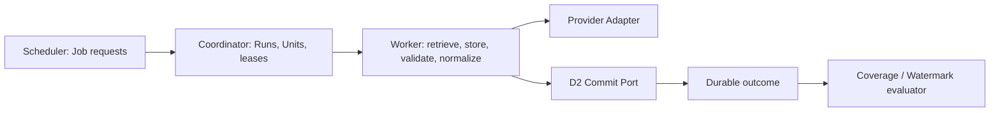

# D3 V1 Phase 0 Population Engine Architecture Audit Report

## Current Understanding

D3 must turn governed provider material into typed D2 Canonical Commit commands without changing consumers, D2, the generic Repository, SQLite, current backfills, Coverage, Projection, Evidence, APIs, schedulers, or workers. Population is operational processing; publication remains a separate governed decision.

## Baseline Verification

| Check | Result |
|---|---|
| Branch | `epic/d2-canonical-persistence` |
| HEAD | `1cb1c8d778033cfe89b4c23f51a7d70160b7d906` |
| D2 tag | `d2-canonical-persistence-v2.1` present |
| Initial worktree | Clean |
| D2 live guarantees | Migration/reset, atomicity, duplicate/conflict, correction, publication, supersession, lineage, outbox, concurrency, privileges, and reconciliation reported as passed |
| D2 limitations | Partial-migration failure injection and bounded-query `EXPLAIN` review not executed |
| D2 documentation drift | Brief says `SAFE TO COMPLETE D2 WITH LIMITATIONS`; checked-in certification uses `LIVE SUITE PASSED; EXTENDED CERTIFICATION REMAINS REQUIRED` |
| Provider requests executed | None |
| PostgreSQL connections or migrations | None |

## Existing Population Inventory

The audited surfaces are detailed in `docs/architecture/population-engine-audit.md`. Repository-backed OHLCV, Funding, OI, Liquidation, and AggTrade modules provide useful retrieval, parsing, deterministic identity, and validation logic but combine these with direct generic Repository writes. The recent-gap orchestrator has deterministic plans and bounded days but only in-memory progress. The legacy OHLCV API route combines retrieval, mutable file jobs, local persistence, and derived generation in one request.

Existing scheduler and worker foundations have fixed intelligence job vocabularies and no population lease store. The file-backed intelligence scheduler is a separate product runtime. None is the D3 control plane.

## Existing Architecture Gaps

- No mandatory immutable raw-object retention before parsing.
- No durable Retrieval Attempt, Population Candidate, lease, checkpoint, or outcome model.
- No fencing token to reject stale workers.
- Validation and D1 quality execution are not separately persisted.
- Existing historical objects contain locally assigned canonical/verified/confidence fields that are not D1 snapshot bindings.
- Existing modules write directly to the generic Repository rather than D2.
- Coverage refresh hints are not governed decisions or safe watermarks.
- Retry behavior is caller-specific and lacks a closed taxonomy.
- Large payload handling is not consistently streaming/object-storage-first.

## Population Domain Model

The bounded model is Job -> Run -> Unit -> Retrieval Attempt -> Raw Artifact/Manifest -> Candidate -> one D2 Canonical Commit. Jobs are mutable operational aggregates over append-only events; Runs are distinct attempts; Units are deterministic retry partitions; Candidates are immutable typed parsed material and are never facts.

One Unit may produce zero or one accepted raw artifact and zero or many Candidates. One Candidate maps to one D2 commit in the initial implementation. Streams produce manifest candidates rather than millions of tick fact rows.

## Identity Model

Job, Run, Unit, Retrieval Attempt, Raw Object, Candidate, Canonical Record, and Commit identities remain distinct. Job and Unit identities are deterministic from ordered profile-specific dimensions. Run and Retrieval Attempt identities distinguish retries. Raw Objects are content-addressed. Candidate identity includes raw object, parser version, source identity, and ordered candidate boundary. Canonical identity remains solely D1/D2-owned.

## Job, Run, and Unit Semantics

A Job is a requested logical body of work and can have many Runs. A Run is one execution attempt and has one lease lineage. A Unit is the smallest independently claimable and retryable partition. Dataset profiles define dimensions; there is no universal symbol/day key.

Job current states are `QUEUED`, `RUNNING`, `SUCCEEDED`, `PARTIAL`, `FAILED`, `CANCELLED`, `PAUSED`, and `EXPIRED`, derived from immutable events and Unit outcomes. Durable successes survive partial failure and cancellation.

## Provider Adapter Boundary

Adapters own capability, request construction, retrieval, raw metadata, parsing, source identity/time semantics, provider error classification, and retry hints. They cannot persist canonical facts, update coverage, publish, calculate confidence, silently repair gaps, or perform ad hoc canonical normalization. Official, verified, and experimental status selects policy and eligibility; it is not confidence.

## Raw Artifact and Manifest Flow

Exact provider bytes are hashed and stored before candidate parsing. The manifest becomes `VERIFIED` only after object existence, size/hash, metadata, and immutable provider snapshot checks pass. Missing or failed verification blocks canonical submission. Large archives, AggTrade, Orderbook, documents, and streams stay outside PostgreSQL.

Use a provider-neutral object-storage port. S3-compatible semantics are the recommended production reference, managed blob storage is viable for bounded preview/small objects, and local filesystem is development-only.

## Validation Boundary

Transport, structural, provider-semantic, canonical eligibility, and cross-record validation are distinct layers with immutable results. Validation failure differs from low quality, inconsistency, and missing coverage. Failures map explicitly to retryable, permanent, unsupported, quarantined, or policy-rejected outcomes.

## Data Quality Boundary

D3 executes the D1 policy bound to the Candidate. Evaluation input references the Candidate and raw manifest; results can be candidate-level or batch-level and blocking or advisory. Thresholds and SLAs remain registry policy, not worker constants. Re-evaluation appends results and does not mutate the Candidate or automatically create a canonical version.

## Canonical Normalization Boundary

Pure, versioned dataset normalizers accept typed Candidates and immutable bindings. They return typed facts and ordered identity/serialization inputs. Provider corrections use the same normalizer. Worker orchestration may select a registered normalizer but cannot contain normalization rules.

## Canonical Commit Integration

D3 calls D2 through a narrow port with one command per eligible Candidate. It does not write canonical SQL. `SUCCESS` becomes `COMMITTED`; `DUPLICATE` is successful idempotent processing; `CONFLICT` is quarantined and blocks progress; `REJECTED` remains policy-visible; retryable failures reuse deterministic identity and reconcile unknown outcomes.

## Transaction Boundaries

Retrieval, object/manifest, Candidate, D2 commit, population outcome, and Coverage/Watermark are separate durable boundaries. The D2 transaction is not extended. A crash after commit but before outcome recording is recovered by D2 reconciliation, then the immutable outcome is appended.

## Idempotency

The architecture uses at-least-once execution with deterministic identities and uniqueness constraints. Job deduplication prevents uncontrolled duplicate work; every Run and Retrieval Attempt remains observable; content addressing deduplicates raw artifacts; Candidate identity makes reparsing stable; D2 owns canonical and outbox idempotency.

## Retry Classification

Network, timeout, policy-permitted 429/5xx, and D2 retryable database outcomes may retry. Unsupported capability, malformed verified content, schema mismatch, validation failure, and conflict do not blindly retry. Retry count and delay are selected from immutable policy profiles; no values are invented in Phase 0.

## Checkpoint, Lease, and Resume

Use short PostgreSQL row claims with `FOR UPDATE SKIP LOCKED`, expiring leases, heartbeats, and monotonic fencing tokens. Every operational mutation requires the current lease token. Never hold a database transaction during provider or object-store I/O. Checkpoints advance only after referenced artifacts/outcomes are durable.

PostgreSQL row leases are the safest initial option. Advisory locks lack durable fencing; external queues are optional future accelerators. The architecture remains compatible with a hybrid queue carrying Unit IDs while PostgreSQL remains truth.

## Batch and Partial Failure Semantics

Jobs expand into independent Units. Successful Units stay durable; failed Units do not roll them back. A mixed terminal result is `PARTIAL`. Resume selects unresolved/retryable Units. Conflicts and blocking quality results prevent relevant watermark advancement. Cancellation does not erase canonical commits.

## Backfill versus Incremental Ingestion

Use one Population Engine with different immutable Job profiles. Backfill profiles generate archive/day/window Units; incremental profiles generate cursor/event/snapshot Units. Both use the same retrieval, artifact, candidate, validation, quality, normalization, D2, and outcome pipeline. This avoids two correctness models while preserving provider-specific partition semantics.

## Coverage and Watermark Rules

Coverage describes observed canonical availability for bounded dimensions. Watermarks describe the highest safe processed boundary under a versioned policy. They update only after durable population outcomes. Duplicates may count as processed; conflicts, unresolved Units, unavailable provider periods, empty responses, blocking quality, and rolled-back/unknown commits cannot silently advance them.

Keys are profile-specific and may include dataset, provider, venue, subject/symbol, resolution, partition, and profile version. No universal watermark key is approved.

## Publication Interaction

D2 creates `PENDING` versions. D3 may enqueue publication-gate evaluation, but certification and publication are asynchronous and policy-owned. Providers cannot publish. Corrections and policy changes require fresh evaluation. Phase 0 does not implement publication runtime.

## Scheduler and Worker Responsibilities

The Scheduler never fetches or persists facts. The Coordinator never parses provider payloads. The Worker never updates consumers or bypasses policy. The Adapter never writes facts. D2 never owns Job progress.

## Vercel and External Worker Boundary

Vercel may submit bounded Jobs and serve bounded status/health reads. Persistent external workers own archive transfer, decompression, parsing, retries, leases, reconciliation, and long-running ingestion. PostgreSQL and object storage are shared durable dependencies. No paid provider is selected in Phase 0.

## Security and Secrets

Provider, object storage, worker database, scheduler, migration, and read-only credentials are separate least-privilege identities. Secrets never enter browser bundles, raw attempt metadata, or logs. Preview and production are isolated. Internal-web ephemeral keys remain non-persistent and mapping-gated.

## Observability

Jobs, Runs, Units, Retrieval Attempts, Manifests, Candidates, validation/quality results, commit/publication results, retry/lease events, and Coverage/Watermark decisions are durable and cross-referenced. Logs supplement but do not replace state. Metrics are defined without thresholds: throughput, retrieval/commit latency, parse/validation failures, duplicates, conflicts, outbox/watermark lag, lease expiry, and retry exhaustion.

## Existing Backfill Migration Strategy

Adapt provider retrieval/parsers behind new interfaces; do not wrap direct Repository writes. Keep existing modules and legacy route as protected migration paths until dataset-by-dataset certification. Start with a bounded fixed-cadence dataset, compare semantic candidates and D2 outcomes without dual-writing, then certify additional profiles. AggTrade and Orderbook remain object/manifest paths.

## Proposed Persistence Tables

Use the existing `control`, `raw`, `quality`, and `quarantine` schemas. No new schema is required initially.

| Table | Ownership and mutability | Purpose / key indexes |
|---|---|---|
| `control.population_jobs` | Immutable specification plus controlled current-state projection | Unique deterministic job identity; status/profile lookup |
| `control.population_job_events` | Append-only | Reconstruct Job state |
| `control.population_runs` | Immutable attempt identity; controlled terminal fields | Job/attempt unique; active Run lookup |
| `control.population_units` | Immutable Unit specification plus controlled state projection | Job/dimension uniqueness; claim index on ready state |
| `control.population_unit_events` | Append-only | Unit lifecycle audit |
| `control.population_leases` | Mutable only through lease procedures; monotonic version | Owner/expiry lookup and fencing |
| `control.population_checkpoints` | Append-only | Latest durable checkpoint by Unit/version |
| `control.population_outcomes` | Append-only | Unit/Candidate/D2 result; unique idempotent outcome identity |
| `control.retry_events` | Append-only | Retry classification and policy binding |
| `raw.retrieval_attempts` | Append-only | Unit/provider/time and response classification |
| `raw.population_candidates` | Immutable typed metadata plus dataset-specific bounded payload/reference | Raw object/source identity/parser uniqueness |
| `quality.candidate_validation_results` | Append-only | Layered validation results and policy binding |
| `quality.candidate_evaluation_runs` | Append-only | D1 quality evaluation input and version |
| `quality.candidate_evaluation_results` | Append-only | Blocking/advisory outcomes |
| `quarantine.population_candidates` | Append-only | Blocked Candidate reference and reasons |
| `coverage.watermark_decisions` | Append-only | Safe advancement decisions and basis |

Current state columns are controlled projections, never sole history. Foreign keys bind Jobs/Runs/Units, raw manifests, candidates, D2 commits, and immutable registry/policy snapshots. Avoid partitioning until observed volume requires it; Retrieval Attempts and event histories are first candidates. Retention applies to operational detail, never required canonical lineage/audit references.

## Alternatives

### Option A: PostgreSQL-driven Job Queue

Lowest initial complexity, strong local development, durable claims and audit. Polling load limits very large scale.

### Option B: External Queue-driven Population

Good delivery scale, but queue state cannot provide canonical audit or exactly-once behavior. Adds vendor/runtime complexity and reconciliation requirements.

### Option C: Hybrid

PostgreSQL remains durable truth while a queue accelerates delivery. Strongest long-term scale and recovery, but premature for initial implementation.

## Recommended Architecture

Adopt Option A initially with interfaces that permit Option C later. Use one shared engine with distinct Job profiles, PostgreSQL durable orchestration and fenced leases, provider-neutral object storage, typed Candidates, pure D1 normalization, and one Candidate per D2 commit. Execution is at least once; correctness comes from deterministic identity, immutable evidence, durable outcomes, and fail-closed gates.

## Risks

| Risk | Severity | Mitigation |
|---|---|---|
| Legacy parsers embed canonical/verified/confidence assertions | High | Treat output as source candidates; rebind through D1 governance |
| Raw payload loss in existing paths | High | Object-storage-first requirement before migrated parser use |
| Stale worker writes | High | Monotonic lease fencing on every operational mutation |
| Coverage advances from hints | High | Separate append-only decision based only on durable outcomes |
| Large archive memory pressure | High | Streaming object write and partition-sized Units |
| D2 report gate wording drift | Medium | Reconcile before production schema deployment/cutover |
| PostgreSQL polling scale | Medium | Bounded claims/indexes; retain queue-compatible port |
| Experimental provider leakage | High | Explicit profile enablement, mappings, snapshots, and certification |

## Blockers

No blocker prevents D3 Phase 1 contract and SQL-blueprint work. Production deployment remains blocked by the preserved D2 limitations and gate wording drift. Provider-specific thresholds, retry counts, payload buffer limits, freshness, quality, and SLAs remain policy work and must not be invented.

## Exact Proposed File Scope

Phase 1 should be additive and limited to:

- `lib/data-platform/population/contracts/**`
- `lib/data-platform/population/identity/**`
- `lib/data-platform/population/policies/**` for references and closed classifications only
- `lib/data-platform/persistence/postgres/migrations/005_*` and later unapplied D3 control-plane blueprints
- bounded D3 contract/static SQL tests under `workers/data-platform-tests/**` or `tests/data-platform/population/**`
- `docs/architecture/population-*.md`
- a new D3 ADR only after explicit architecture approval
- `docs/project/d3-phase-1-implementation-report.md`

Phase 1 must not modify existing backfills, schedulers, workers, D2 adapter/runtime, consumers, Repository, SQLite, APIs, Coverage, Projection, Evidence, packages, configuration, or environments.

## D3 Phase 1 Recommendation

Implement bounded TypeScript contracts, identity/transition validators, provider-adapter ports, object-store ports, Canonical Commit port, SQL blueprints, unapplied migrations, and static contract tests. Do not bind a live provider, worker loop, scheduler, D2 database, or consumer in Phase 1.

## Final Gate

`SAFE TO IMPLEMENT D3 PHASE 1 WITH LIMITATIONS`
